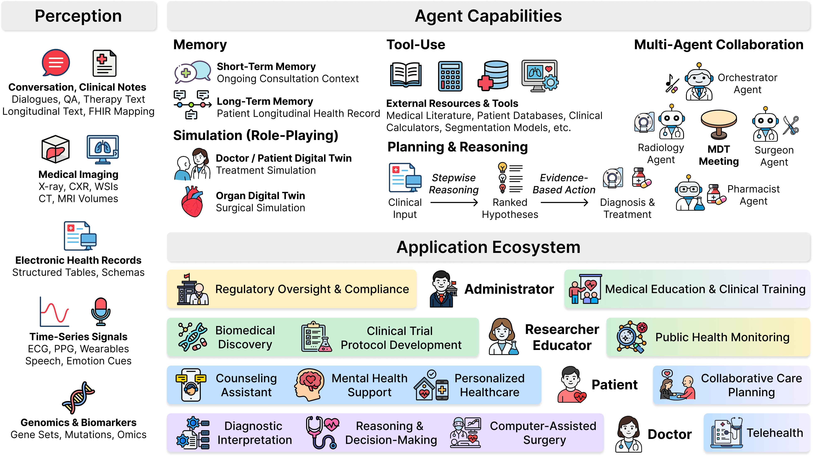
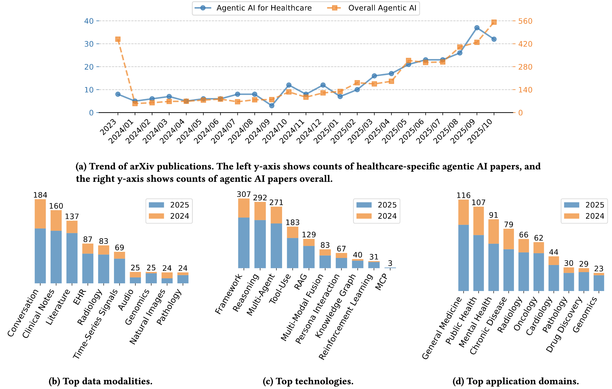

# Awesome AI Agents for Healthcare

[](https://awesome.re)

[](https://www.techrxiv.org/users/994756/articles/1355990-a-comprehensive-survey-of-agentic-ai-in-healthcare)
[](https://github.com/AgenticHealthAI/Awesome-AI-Agents-for-Healthcare)

This repository is a curated list of research papers, projects, and resources related to the application of **Agentic AI / AI agents for healthcare**, including medical image analysis, EHR manipulation, counseling, drug discovery, patient dialogue, and healthcare administration. AI agents refer to artificial intelligence systems that can autonomously perform tasks, make decisions, and interact with their environment, often through the use of large language models (LLMs), multi-agent systems, and tool integrations.

1. The image below introduces a comprehensive conceptual framework. It provides a holistic view, detailing the pipeline from initial data perception and foundational agent capabilities to a hierarchical application ecosystem.

<p align="center">
  
</p>

2. We conducted a quantitative analysis of recent academic literature, with the key findings summarised in the image below. This analysis provides a data-driven snapshot of the field’s growth trajectory, technological underpinnings, and application hotspots:

* **Top Data Modalities**: Textual data remains the most frequently utilized modality. Time-Series and Genomics exhibit a high proportion of publications from 2025.
* **Top Technologies**: The technological focus is heavily concentrated on three topics: 1) developing highlevel Frameworks, 2) enhancing agent Reasoning, and 3) designing Multi-Agent collaboration paradigms.
* **Top Application Domains**: Agentic AI continues to be widely applied in broad domains like General Medicine, Public Health, and Mental Health. Drug Discovery and Genomics are particularly new frontiers.

<p align="center">
  
</p>

We will try to keep this list updated. If you find any errors or any missing papers, please don't hesitate to open issues or pull requests.

**📘 Read our survey paper here:** [A Comprehensive Survey of AI Agents for Healthcare](https://www.techrxiv.org/users/994756/articles/1355990-a-comprehensive-survey-of-agentic-ai-in-healthcare)

If you find our paper and repository helpful, please cite:

```
@article{xu2025comprehensive,
  title={A Comprehensive Survey of Agentic AI in Healthcare},
  author={Xu, Gelei and Li, Xueyang and Chen, Yixiong and Duan, Yuying and Wu, Shuqing and Yu, Alexander and Chiu, Ching-Hao and Ni, Juntong and Tang, Ningzhi and Li, Toby Jia-Jun and others},
  journal={Authorea Preprints},
  year={2025},
  publisher={Authorea}
}
```

---

#### Table of Contents

- [**Latest Papers**](#latest-papers)
  - [**Year 2026**](#year-2026)
  - [**Year 2025**](#year-2025)
  - [**Year 2024**](#year-2024)
  - [**Year 2023**](#year-2023)
- [**Papers by Category**](#papers-by-category)
  - [**1. Doctor-facing Agents**](#1-doctor-facing-agents)
    - [**1.1 Multi-Modal Clinical Agents**](#11-multi-modal-clinical-agents)
    - [**1.2 Radiology Agents (CT, X-ray, MRI, etc.)**](#12-radiology-agents-ct-x-ray-mri-etc)
    - [**1.3 Pathology Agents**](#13-pathology-agents)
    - [**1.4 Cardiovascular Imaging**](#14-cardiovascular-imaging)
    - [**1.5 Sonography / Ultrasound**](#15-sonography--ultrasound)
    - [**1.6 Radiotherapy**](#16-radiotherapy)
    - [**1.7 Dermatology**](#17-dermatology)
    - [**1.8 Dental Agents**](#18-dental-agents)
    - [**1.9 Genomics \& Biomarker Agents**](#19-genomics--biomarker-agents)
    - [**1.10 EHR \& Clinical Note Agents**](#110-ehr--clinical-note-agents)
    - [**1.11 Surgical Agents**](#111-surgical-agents)
    - [**1.12 Education Agents**](#112-education-agents)
    - [**1.13 Reasoning \& Multi Agent Techniques**](#113-reasoning--multi-agent-techniques)
  - [**2. Patient-Facing Applications**](#2-patient-facing-applications)
    - [**2.1 Mental Health \& CBT Agents**](#21-mental-health--cbt-agents)
    - [**2.2 Clinical Communication \& Intake Agents**](#22-clinical-communication--intake-agents)
    - [**2.3 Screening \& Personalized Care Agents**](#23-screening--personalized-care-agents)
    - [**2.4 General-purpose Healthcare Avatars**](#24-general-purpose-healthcare-avatars)
  - [**3. Drug Discovery \& Development**](#3-drug-discovery--development)
  - [**4. Healthcare Administration \& Workflow**](#4-healthcare-administration--workflow)
  - [**5. Datasets \& Benchmarks**](#5-datasets--benchmarks)
  - [**6. Related Surveys**](#6-related-surveys)
    - [**6.1 General Healthcare AI Agent Surveys**](#61-general-healthcare-ai-agent-surveys)
    - [**6.2 Radiology-Specific Surveys**](#62-radiology-specific-surveys)
    - [**6.3 Specialty-Specific Surveys**](#63-specialty-specific-surveys)
    - [**6.4 Biomedical Research & Discovery Surveys**](#64-biomedical-research--discovery-surveys)
- [**Open-Source Projects & Tools**](#open-source-projects--tools)
- [**Acknowledgement**](#acknowledgement)
- [**Star History**](#star-history)

---

# Latest Papers

## Year 2026

1. [arxiv 2026.3] **Meissa: Multi-modal Medical Agentic Intelligence** [[paper]](https://arxiv.org/abs/2603.09018) [[Github]](https://github.com/Schuture/Meissa)
1. [ICLR 2026] **CARE: Towards Clinical Accountability in Multi-Modal Medical Reasoning with an Evidence-Grounded Agentic Framework** [[paper]](https://arxiv.org/abs/2603.01607)
1. [ICLR 2026] **ATPO: Adaptive Tree Policy Optimization for Multi-Turn Medical Dialogue** [[paper]](https://arxiv.org/abs/2603.02216)
1. [EACL 2026 Workshop] **Do Mixed-Vendor Multi-Agent LLMs Improve Clinical Diagnosis?** [[paper]](https://arxiv.org/abs/2603.04421)
1. [arxiv 2026.3] **MedCoRAG: Interpretable Hepatology Diagnosis via Hybrid Evidence Retrieval and Multispecialty Consensus** [[paper]](https://arxiv.org/abs/2603.05129)
1. [arxiv 2026.3] **MedCollab: Causal-Driven Multi-Agent Collaboration for Full-Cycle Clinical Diagnosis via IBIS-Structured Argumentation** [[paper]](https://arxiv.org/abs/2603.01131)
1. [arxiv 2026.3] **From Conflict to Consensus: Boosting Medical Reasoning via Multi-Round Agentic RAG** [[paper]](https://arxiv.org/abs/2603.03292) [[Github]](https://github.com/NJU-RL/MA-RAG)
1. [arxiv 2026.3] **MIND: Unified Inquiry and Diagnosis RL with Criteria Grounded Clinical Supports for Psychiatric Consultation** [[paper]](https://arxiv.org/abs/2603.03677)
1. [arxiv 2026.3] **DUCX: Decomposing Unfairness in Tool-Using Chest X-ray Agents** [[paper]](https://arxiv.org/abs/2603.00777)
1. [arxiv 2026.3] **OPGAgent: An Agent for Auditable Dental Panoramic X-ray Interpretation** [[paper]](https://arxiv.org/abs/2603.00462)
1. [arxiv 2026.3] **TARSE: Test-Time Adaptation via Retrieval of Skills and Experience for Reasoning Agents** [[paper]](https://arxiv.org/abs/2603.01241)
1. [arxiv 2026.3] **ProtRLSearch: A Multi-Round Multimodal Protein Search Agent with Large Language Models Trained via Reinforcement Learning** [[paper]](https://arxiv.org/abs/2603.01464)
1. [arxiv 2026.3] **A Multi-Agent Framework for Interpreting Multivariate Physiological Time Series** [[paper]](https://arxiv.org/abs/2603.04142)
1. [HealthSec/ACSAC 2026] **Goal-Driven Risk Assessment for LLM-Powered Systems: A Healthcare Case Study** [[paper]](https://arxiv.org/abs/2603.03633)
1. [arxiv 2026.2] **3DMedAgent: Unified Perception-to-Understanding for 3D Medical Analysis** [[paper]](https://arxiv.org/abs/2602.18064)
1. [arxiv 2026.2] **Can Agents Distinguish Visually Hard-to-Separate Diseases in a Zero-Shot Setting?** [[paper]](https://arxiv.org/abs/2602.22959) [[Github]](https://github.com/TruhnLab/Contrastive-Agent-Reasoning)
1. [arxiv 2026.2] **Which Tool Response Should I Trust? Tool-Expertise-Aware Chest X-ray Agent with Multimodal Agentic Learning** [[paper]](https://arxiv.org/abs/2602.21517)
1. [arxiv 2026.2] **MedClarify: An Information-Seeking AI Agent for Medical Diagnosis with Case-Specific Follow-up Questions** [[paper]](https://arxiv.org/abs/2602.17308)
1. [arxiv 2026.2] **LAMMI-Pathology: A Tool-Centric Bottom-Up LVLM-Agent Framework for Molecularly Informed Medical Intelligence in Pathology** [[paper]](https://arxiv.org/abs/2602.18773)
1. [arxiv 2026.2] **NutriOrion: A Hierarchical Multi-Agent Framework for Personalized Nutrition Intervention Grounded in Clinical Guidelines** [[paper]](https://arxiv.org/abs/2602.18650)
1. [arxiv 2026.2] **TRACE: Temporal Reasoning via Agentic Context Evolution for Streaming Electronic Health Records** [[paper]](https://arxiv.org/abs/2602.12833)
1. [arxiv 2026.2] **CoMMa: Contribution-Aware Medical Multi-Agents From A Game-Theoretic Perspective** [[paper]](https://arxiv.org/abs/2602.09159)
1. [AAAI 2026 Workshop] **SynthAgent: A Multi-Agent LLM Framework for Realistic Patient Simulation** [[paper]](https://arxiv.org/abs/2602.08254)
1. [arxiv 2026.2] **MedCoG: Maximizing LLM Inference Density in Medical Reasoning via Meta-Cognitive Regulation** [[paper]](https://arxiv.org/abs/2602.07905)
1. [arxiv 2026.2] **Picking the Right Specialist: Attentive Neural Process-based Selection of Task-Specialized Models as Tools for Agentic Healthcare Systems** [[paper]](https://arxiv.org/abs/2602.14901)
1. [arxiv 2026.2] **A Multi-Agent Framework for Medical AI: Leveraging Fine-Tuned GPT, LLaMA, and DeepSeek R1 for Evidence-Based and Bias-Aware Clinical Query Processing** [[paper]](https://arxiv.org/abs/2602.14158)
1. [arxiv 2026.2] **MedScope: Incentivizing "Think with Videos" for Clinical Reasoning via Coarse-to-Fine Tool Calling** [[paper]](https://arxiv.org/abs/2602.13332)
1. [arxiv 2026.2] **MedXIAOHE: A Comprehensive Recipe for Building Medical MLLMs** [[paper]](https://arxiv.org/abs/2602.12705)
1. [arxiv 2026.2] **Advancing AI Trustworthiness Through Patient Simulation: Risk Assessment of Conversational Agents for Antidepressant Selection** [[paper]](https://arxiv.org/abs/2602.11391)
1. [arxiv 2026.2] **LiveMedBench: A Contamination-Free Medical Benchmark for LLMs with Automated Rubric Evaluation** [[paper]](https://arxiv.org/abs/2602.10367)
1. [arxiv 2026.2] **Closing Reasoning Gaps in Clinical Agents with Differential Reasoning Learning** [[paper]](https://arxiv.org/abs/2602.09945)
1. [ICHI 2026] **Human-Guided Agentic AI for Multimodal Clinical Prediction: Lessons from the AgentDS Healthcare Benchmark** [[paper]](https://arxiv.org/abs/2602.19502)
1. [arxiv 2026.2] **ALPACA: A Reinforcement Learning Environment for Medication Repurposing and Treatment Optimization in Alzheimer's Disease** [[paper]](https://arxiv.org/abs/2602.19298)
1. [arxiv 2026.2] **The Doctor Will (Still) See You Now: On the Structural Limits of Agentic AI in Healthcare** [[paper]](https://arxiv.org/abs/2602.18460)
1. [arxiv 2026.2] **Agentic AI, Medical Morality, and the Transformation of the Patient-Physician Relationship** [[paper]](https://arxiv.org/abs/2602.16553)
1. [IEEE Access 2026] **Agentic AI in Healthcare & Medicine: A Seven-Dimensional Taxonomy for Empirical Evaluation of LLM-based Agents** [[paper]](https://arxiv.org/abs/2602.04813)
1. [arxiv 2026.2] **MedSAM-Agent: Empowering Interactive Medical Image Segmentation with Multi-turn Agentic Reinforcement Learning** [[paper]](https://arxiv.org/abs/2602.03320) [[Github]](https://github.com/CUHK-AIM-Group/MedSAM-Agent)
1. [arxiv 2026.2] **Pruning Minimal Reasoning Graphs for Efficient Retrieval-Augmented Generation** [[paper]](https://arxiv.org/abs/2602.04926)
1. [arxiv 2026.2] **RE-MCDF: Closed-Loop Multi-Expert LLM Reasoning for Knowledge-Grounded Clinical Diagnosis** [[paper]](https://arxiv.org/abs/2602.01297)
1. [arxiv 2026.2] **MedBeads: An Agent-Native, Immutable Data Substrate for Trustworthy Medical AI** [[paper]](https://arxiv.org/abs/2602.01086)
1. [arxiv 2026.2] **AutoHealth: An Uncertainty-Aware Multi-Agent System for Autonomous Health Data Modeling** [[paper]](https://arxiv.org/abs/2602.01078)
1. [CAIN 2026] **Engineering AI Agents for Clinical Workflows: A Case Study in Architecture, MLOps, and Governance** [[paper]](https://arxiv.org/abs/2602.00751)
1. [arxiv 2026.2] **ExperienceWeaver: Optimizing Small-sample Experience Learning for LLM-based Clinical Text Improvement** [[paper]](https://arxiv.org/abs/2602.00740)
1. [arxiv 2026.1] **EvoClinician: A Self-Evolving Agent for Multi-Turn Medical Diagnosis via Test-Time Evolutionary Learning** [[paper]](https://arxiv.org/abs/2601.22964) [[Github]](https://github.com/yf-he/EvoClinician)
1. [arxiv 2026.1] **Scaling Medical Reasoning Verification via Tool-Integrated Reinforcement Learning** [[paper]](https://arxiv.org/abs/2601.20221)
1. [arxiv 2026.1] **DEEPMED: Building a Medical DeepResearch Agent via Multi-hop Med-Search Data** [[paper]](https://arxiv.org/abs/2601.18496)
1. [arxiv 2026.1] **AgentsEval: Clinically Faithful Evaluation of Medical Imaging Reports via Multi-Agent Reasoning** [[paper]](https://arxiv.org/abs/2601.16685)
1. [arxiv 2026.1] **AgentEHR: Advancing Autonomous Clinical Decision-Making via Retrospective Summarization** [[paper]](https://arxiv.org/abs/2601.13918)
1. [arxiv 2026.1] **MedConsultBench: A Full-Cycle, Fine-Grained, Process-Aware Benchmark for Medical Consultation Agents** [[paper]](https://arxiv.org/abs/2601.12661)
1. [EACL 2026] **Knowing When to Abstain: Medical LLMs Under Clinical Uncertainty** [[paper]](https://arxiv.org/abs/2601.12471)
1. [arxiv 2026.1] **Route, Retrieve, Reflect, Repair: Self-Improving Agentic Framework for Visual Detection and Linguistic Reasoning in Medical Imaging** [[paper]](https://arxiv.org/abs/2601.08192) [[Github]](https://github.com/faiyazabdullah/MultimodalMedAgent)
1. [arxiv 2026.1] **MEDVISTAGYM: A Scalable Training Environment for Thinking with Medical Images via Tool-Integrated Reinforcement Learning** [[paper]](https://arxiv.org/abs/2601.07107)
1. [arxiv 2026.1] **MedEinst: Benchmarking the Einstellung Effect in Medical LLMs through Counterfactual Differential Diagnosis** [[paper]](https://arxiv.org/abs/2601.06636)
1. [arxiv 2026.1] **DemMA: Dementia Multi-Turn Dialogue Agent with Expert-Guided Reasoning and Action Simulation** [[paper]](https://arxiv.org/abs/2601.06373)
1. [arxiv 2026.1] **IBISAgent: Reinforcing Pixel-Level Visual Reasoning in MLLMs for Universal Biomedical Object Referring and Segmentation** [[paper]](https://arxiv.org/abs/2601.03054)
1. [arxiv 2026.1] **Bayesian Orchestration of Multi-LLM Agents for Cost-Aware Sequential Decision-Making** [[paper]](https://arxiv.org/abs/2601.01522)
1. [arxiv 2026.1] **An Explainable Agentic AI Framework for Uncertainty-Aware and Abstention-Enabled Acute Ischemic Stroke Imaging Decisions** [[paper]](https://arxiv.org/abs/2601.01008)
1. [AAAI 2026] **ShortageSim: Simulating Drug Shortages under Information Asymmetry** [[paper]](http://arxiv.org/abs/2509.01813)
1. [ICLR 2026] **MedAgentGym: Training LLM Agents for Code-Based Medical Reasoning at Scale** [[paper]](https://openreview.net/pdf?id=oZSofhtmIc#page=0.42) [[Github]](https://github.com/wshi83/MedAgentGym)
1. [AAAI 2026] **LungNoduleAgent: A Collaborative Multi-Agent System for Precision Diagnosis of Lung Nodules** [[paper]](https://arxiv.org/abs/2511.21042) [[Github]](https://github.com/ImYangC7/LungNoduleAgent)
1.  [Nature Communications 2026] **Wearable Intelligent Throat Enables Natural Speech in Stroke Patients with Dysarthria** [[paper]](http://arxiv.org/abs/2411.18266v3)
1. [npj Artificial Intelligence 2026] **AI agent in healthcare: applications, evaluations, and future directions** [[paper]](https://www.nature.com/articles/s44387-026-00076-4)
1. [npj Digital Medicine 2026] **Benchmarking large language model-based agent systems for clinical decision tasks** [[paper]](https://www.nature.com/articles/s41746-026-02443-6)
1. [npj Digital Medicine 2026] **Reimagining psychiatric care with agentic AI: promise, challenges, and a roadmap forward** [[paper]](https://www.nature.com/articles/s41746-026-02453-4)
1. [Nature Biotechnology 2026] **Agentic AI and the rise of in silico team science in biomedical research** [[paper]](https://www.nature.com/articles/s41587-026-03035-1)

## Year 2025


1. [arxiv 2025.12] **Hybrid-Code: A Privacy-Preserving, Redundant Multi-Agent Framework for Reliable Local Clinical Coding** [[paper]](https://arxiv.org/abs/2512.23743)
1. [arxiv 2025.12] **ClinDEF: A Dynamic Evaluation Framework for Large Language Models in Clinical Reasoning** [[paper]](https://arxiv.org/abs/2512.23440)
1. [arxiv 2025.12] **HARMON-E: Hierarchical Agentic Reasoning for Multimodal Oncology Notes to Extract Structured Data** [[paper]](https://arxiv.org/abs/2512.19864)
1. [arxiv 2025.12] **Bidirectional human-AI collaboration in brain tumour assessments improves both expert human and AI agent performance** [[paper]](https://arxiv.org/abs/2512.19707)
1. [arxiv 2025.12] **On-device Large Multi-modal Agent for Human Activity Recognition** [[paper]](https://arxiv.org/abs/2512.19742)
1. [arxiv 2025.12] **Scalably Enhancing the Clinical Validity of a Task Benchmark with Physician Oversight** [[paper]](https://arxiv.org/abs/2512.19691)
1. [arxiv 2025.12] **Agent-Based Output Drift Detection for Breast Cancer Response Prediction in a Multisite Clinical Decision Support System** [[paper]](https://arxiv.org/abs/2512.18450)
1. [arxiv 2025.12] **An Agentic AI Framework for Training General Practitioner Student Skills** [[paper]](https://arxiv.org/abs/2512.18440)
1. [arxiv 2025.12] **ReX-MLE: The Autonomous Agent Benchmark for Medical Imaging Challenges** [[paper]](https://arxiv.org/abs/2512.17838)
1. [arxiv 2025.12] **AdaSearch: Balancing Parametric Knowledge and Search in Large Language Models via Reinforcement Learning** [[paper]](https://arxiv.org/abs/2512.16883)
1. [arxiv 2025.12] **A Multi-Agent Large Language Model Framework for Automated Qualitative Analysis** [[paper]](https://arxiv.org/abs/2512.16063)
1. [arxiv 2025.12] **Mapis: A Knowledge-Graph Grounded Multi-Agent Framework for Evidence-Based PCOS Diagnosis** [[paper]](https://arxiv.org/abs/2512.15398)
1. [arxiv 2025.12] **INFORM-CT: INtegrating LLMs and VLMs FOR Incidental Findings Management in Abdominal CT** [[paper]](https://arxiv.org/abs/2512.14732)
1. [arxiv 2025.12] **Multi-Agent Medical Decision Consensus Matrix System: An Intelligent Collaborative Framework for Oncology MDT Consultations** [[paper]](https://arxiv.org/abs/2512.14321)
1. [arxiv 2025.12] **Incentivizing Tool-augmented Thinking with Images for Medical Image Analysis** [[paper]](https://arxiv.org/abs/2512.14157)
1. [arxiv 2025.12] **MedInsightBench: Evaluating Medical Analytics Agents Through Multi-Step Insight Discovery in Multimodal Medical Data** [[paper]](https://arxiv.org/abs/2512.13297)
1. [arxiv 2025.12] **Socratic Students: Teaching Language Models to Learn by Asking Questions** [[paper]](https://arxiv.org/abs/2512.13102)
1. [arxiv 2025.12] **MedAI: Evaluating TxAgent's Therapeutic Agentic Reasoning in the NeurIPS CURE-Bench Competition** [[paper]](https://arxiv.org/abs/2512.11682) [[Benchmark & Competition]](https://curebench.ai/)
1. [arxiv 2025.12] **CP-Env: Evaluating Large Language Models on Clinical Pathways in a Controllable Hospital Environment** [[paper]](https://arxiv.org/abs/2512.10206) [[Github]](https://github.com/SPIRAL-MED/CP_ENV)
1. [arxiv 2025.12] **AutoMedic: An Automated Evaluation Framework for Clinical Conversational Agents with Medical Dataset Grounding** [[paper]](https://arxiv.org/abs/2512.10195)
1. [arxiv 2025.12] **Exploring Community-Powered Conversational Agent for Health Knowledge Acquisition: A Case Study in Colorectal Cancer** [[paper]](https://arxiv.org/abs/2512.09511)
1. [arxiv 2025.12] **Multi-Agent Intelligence for Multidisciplinary Decision-Making in Gastrointestinal Oncology** [[paper]](https://arxiv.org/abs/2512.08674)
1. [arxiv 2025.12] **DART: Leveraging Multi-Agent Disagreement for Tool Recruitment in Multimodal Reasoning** [[paper]](https://arxiv.org/abs/2512.07132)
1. [arxiv 2025.12] **ClinNoteAgents: An LLM Multi-Agent System for Predicting and Interpreting Heart Failure 30-Day Readmission from Clinical Notes** [[paper]](https://arxiv.org/abs/2512.07081)
1. [arxiv 2025.12] **MedTutor-R1: Socratic Personalized Medical Teaching with Multi-Agent Simulation** [[paper]](https://arxiv.org/abs/2512.05671) [[Github]](https://github.com/Zhitao-He/MedTutor-R1)
1. [arxiv 2025.12] **MCP-AI: Protocol-Driven Intelligence Framework for Autonomous Reasoning in Healthcare** [[paper]](https://arxiv.org/abs/2512.05365)
1. [ICCV 2025 Highlight] **Multi-Aspect Knowledge-Enhanced Medical Vision-Language Pretraining with Multi-Agent Data Generation** [[paper]](https://arxiv.org/abs/2512.03445) [[Github]](https://github.com/SiyuanYan1/Derm1M)
1. [arxiv 2025.12] **Thucy: An LLM-based Multi-Agent System for Claim Verification across Relational Databases** [[paper]](https://arxiv.org/abs/2512.03278)
1. [arxiv 2025.12] **Many-to-One Adversarial Consensus: Exposing Multi-Agent Collusion Risks in AI-Based Healthcare** [[paper]](https://arxiv.org/abs/2512.03097)
1. [arxiv 2025.12] **FinAgent: An Agentic AI Framework Integrating Personal Finance and Nutrition Planning** [[paper]](https://arxiv.org/abs/2512.20991)
1. [arxiv 2025.12] **Radiologist Copilot: Agentic AI Assistant for Holistic Radiology Reporting with Quality Control** [[paper]](https://arxiv.org/abs/2512.02814)
1. [arxiv 2025.12] **UCAgents: Unidirectional Convergence for Visual Evidence Anchored Multi-Agent Medical Decision-Making** [[paper]](https://arxiv.org/abs/2512.02485)
1. [arxiv 2025.12] **First, do NOHARM: towards clinically safe large language models** [[paper]](https://arxiv.org/abs/2512.01241)
1. [arxiv 2025.12] **Causal Reinforcement Learning based Agent-Patient Interaction with Clinical Domain Knowledge** [[paper]](https://arxiv.org/abs/2512.00048)
1. [arxiv 2025.11] **MedEyes: Learning Dynamic Visual Focus for Medical Progressive Diagnosis** [[paper]](https://arxiv.org/abs/2511.22018) [[GitHub]](https://github.com/zhcz328/MedEyes)
1. [arxiv 2025.11] **MedSAM3: Delving into Segment Anything with Medical Concepts** [[paper]](https://arxiv.org/abs/2511.19046) [[Github]](https://github.com/Joey-S-Liu/MedSAM3)
1. [arxiv 2025.11] **SurvAgent: Hierarchical CoT-Enhanced Case Banking and Dichotomy-Based Multi-Agent System for Multimodal Survival Prediction** [[paper]](https://arxiv.org/abs/2511.16635)
1. [arxiv 2025.11] **KOM: A Multi-Agent Artificial Intelligence System for Precision Management of Knee Osteoarthritis (KOA)** [[paper]](https://arxiv.org/abs/2511.19798)
1. [arxiv 2025.11] **KRAL: Knowledge and Reasoning Augmented Learning for LLM-assisted Clinical Antimicrobial Therapy** [[paper]](https://arxiv.org/abs/2511.15974)
1. [arxiv 2025.11] **Medical Malice: A Dataset for Context-Aware Safety in Healthcare LLMs** [[paper]](https://arxiv.org/abs/2511.21757)
1. [arxiv 2025.11] **MedBench v4: A Robust and Scalable Benchmark for Evaluating Chinese Medical Language Models, Multimodal Models, and Intelligent Agents** [[paper]](https://arxiv.org/abs/2511.14439)
1. [arxiv 2025.11] **Fair-GNE: Generalized Nash Equilibrium-Seeking Fairness in Multiagent Healthcare Automation** [[paper]](https://arxiv.org/abs/2511.14135)
1. [arxiv 2025.11] **MedDCR: Learning to Design Agentic Workflows for Medical Coding** [[paper]](https://arxiv.org/abs/2511.13361)
1. [arxiv 2025.11] **Grounded by Experience: Generative Healthcare Prediction Augmented with Hierarchical Agentic Retrieval** [[paper]](https://arxiv.org/abs/2511.13293)
1. [arxiv 2025.11] **OEMA: Ontology-Enhanced Multi-Agent Collaboration Framework for Zero-Shot Clinical Named Entity Recognition** [[paper]](https://arxiv.org/abs/2511.15211)
1. [arxiv 2025.11] **MedBuild AI: An Agent-Based Hybrid Intelligence Framework for Reshaping Agency in Healthcare Infrastructure Planning through Generative Design for Medical Architecture** [[paper]](https://arxiv.org/abs/2511.11587)
1.  [arxiv 2025.11] **From Passive to Proactive: A Multi-Agent System with Dynamic Task Orchestration for Intelligent Medical Pre-Consultation** [[paper]](https://arxiv.org/abs/2511.01445)
1.  [arxiv 2025.11] **Fine-Tuning DialoGPT on Common Diseases in Rural Nepal for Medical Conversations** [[paper]](https://arxiv.org/abs/2511.00514)
1.  [arxiv 2025.10] **Traj-CoA: Patient Trajectory Modeling via Chain-of-Agents for Lung Cancer Risk Prediction** [[paper]](https://arxiv.org/abs/2510.10454)
1.  [arxiv 2025.10] **FT-ARM: Fine-Tuned Agentic Reflection Multimodal Language Model for Pressure Ulcer Severity Classification with Reasoning** [[paper]](https://arxiv.org/abs/2510.24980)
1.  [arxiv 2025.10] **SNOMED CT-powered Knowledge Graphs for Structured Clinical Data and Diagnostic Reasoning** [[paper]](https://arxiv.org/abs/2510.16899)
1.  [arxiv 2025.10] **Speculative Model Risk in Healthcare AI: Using Storytelling to Surface Unintended Harms** [[paper]](https://arxiv.org/abs/2510.14718)
1.  [arxiv 2025.10] **MedCoAct: Confidence-Aware Multi-Agent Collaboration for Complete Clinical Decision** [[paper]](https://arxiv.org/abs/2510.10461)
1.  [arxiv 2025.10] **Haibu Mathematical-Medical Intelligent Agent:Enhancing Large Language Model Reliability in Medical Tasks via Verifiable Reasoning Chains** [[paper]](https://arxiv.org/abs/2510.07748)
1.  [arxiv 2025.10] **Reinforcement Learning for Clinical Reasoning: Aligning LLMs with ACR Imaging Appropriateness Criteria** [[paper]](https://arxiv.org/abs/2510.05194)
1.  [EMNLP 2025 Industry] **CLARITY: Clinical Assistant for Routing, Inference, and Triage** [[paper]](https://arxiv.org/abs/2510.02463)
1.  [arxiv 2025.10] **Secure Multi-Modal Data Fusion in Federated Digital Health Systems via MCP** [[paper]](https://arxiv.org/abs/2510.01780)
1.  [arxiv 2025.9] **AgenticAD: A Specialized Multiagent System Framework for Holistic Alzheimer Disease Management** [[paper]](https://arxiv.org/abs/2510.08578)
1.  [arxiv 2025.9] **Agentic-AI Healthcare: Multilingual, Privacy-First Framework with MCP Agents** [[paper]](https://arxiv.org/abs/2510.02325)
1.  [arxiv 2025.9] **Online Decision Making with Generative Action Sets** [[paper]](https://arxiv.org/abs/2509.25777)
1.  [arxiv 2025.9] **PAME-AI: Patient Messaging Creation and Optimization using Agentic AI** [[paper]](https://arxiv.org/abs/2509.24263)
1.  [arxiv 2025.9] **A co-evolving agentic AI system for medical imaging analysis** [[paper]](https://arxiv.org/abs/2509.20279)
1.  [arxiv 2025.9] **FHIR-AgentBench: Benchmarking LLM Agents for Realistic Interoperable EHR Question Answering** [[paper]](https://arxiv.org/abs/2509.19319) [[Github]](https://github.com/glee4810/FHIR-AgentBench)
1.  [arxiv 2025.9] **MedFact: Benchmarking the Fact-Checking Capabilities of Large Language Models on Chinese Medical Texts** [[paper]](https://arxiv.org/abs/2509.12440) [[Github]](https://github.com/ivy3h/MedFact)
1.  [arxiv 2025.9] **Agentic Temporal Graph of Reasoning with Multimodal Language Models: A Potential AI Aid to Healthcare** [[paper]](https://arxiv.org/abs/2509.11944)
1.  [arxiv 2025.9] **Using AI to Optimize Patient Transfer and Resource Utilization During Mass-Casualty Incidents: A Simulation Platform** [[paper]](https://arxiv.org/abs/2509.08756)
1.  [arxiv 2025.9] **Demo: Healthcare Agent Orchestrator (HAO) for Patient Summarization in Molecular Tumor Boards** [[paper]](https://arxiv.org/abs/2509.06602) [[Github]](https://github.com/Azure-Samples/healthcare-agent-orchestrator)
1.  [arxiv 2025.9] **Chatbot To Help Patients Understand Their Health** [[paper]](https://arxiv.org/abs/2509.05818)
1.  [arxiv 2025.9] **Code Like Humans: A Multi-Agent Solution for Medical Coding** [[paper]](http://arxiv.org/abs/2509.05378)
1.  [arxiv 2025.8] **The Anatomy of a Personal Health Agent** [[paper]](http://arxiv.org/abs/2508.20148)
1.  [arxiv 2025.8] **MedResearcher-R1: Expert-Level Medical Deep Researcher via A Knowledge-Informed Trajectory Synthesis Framework** [[paper]](https://arxiv.org/abs/2508.14880) [[Github]](https://github.com/AQ-MedAI/MedResearcher-R1)
1.  [arxiv 2025.8] **ChatThero: An LLM-Supported Chatbot for Behavior Change and Therapeutic Support in Addiction Recovery** [[paper]](http://arxiv.org/abs/2508.20996)
1.  [arxiv 2025.8] **Automated Clinical Problem Detection from SOAP Notes using a Collaborative Multi-Agent LLM Architecture** [[paper]](http://arxiv.org/abs/2508.21803)
1.  [arxiv 2025.8] **Trustworthy Agents for Electronic Health Records through Confidence Estimation** [[paper]](http://arxiv.org/abs/2508.19096)
1.  [arxiv 2025.8] **AT-CXR: Uncertainty-Aware Agentic Triage for Chest X-rays** [[paper]](http://arxiv.org/abs/2508.19322)
1.  [arxiv 2025.8] **End-to-End Agentic RAG System Training for Traceable Diagnostic Reasoning** [[paper]](http://arxiv.org/abs/2508.15746)
1.  [arxiv 2025.8] **Organ-Agents: Virtual Human Physiology Simulator via LLMs** [[paper]](http://arxiv.org/abs/2508.14357)
1. [arxiv 2025.8] **A Multi-Agent Approach to Neurological Clinical Reasoning** [[paper]](https://arxiv.org/abs/2508.14063)
1. [arxiv 2025.8] **PASS: Probabilistic Agentic Supernet Sampling for Interpretable and Adaptive Chest X-Ray Reasoning** [[paper]](http://arxiv.org/abs/2508.10501v1)
1. [arxiv 2025.8] **HealthFlow: A Self-Evolving AI Agent with Meta Planning for Autonomous Healthcare Research** [[paper]](https://arxiv.org/abs/2508.02621) [[code]](https://github.com/yhzhu99/HealthFlow)
1. [arxiv 2025.8] **ConfAgents: A Conformal-Guided Multi-Agent Framework for Cost-Efficient Medical Diagnosis** [[paper]](https://arxiv.org/abs/2508.04915)
1. [arxiv 2025.8] **Colacare: Enhancing electronic health record modeling through large language model-driven multi-agent collaboration** [[paper]](https://arxiv.org/abs/2410.02551)[[project page]](https://colacare.netlify.app/)
1. [arxiv 2025.8] **FEAT: A Multi-Agent Forensic AI System with Domain-Adapted Large Language Model for Automated Cause-of-Death Analysis** [[paper]](https://arxiv.org/abs/2502.20301)
1. [arxiv 2025.8] **Are Large Language Models Dynamic Treatment Planners? An In Silico Study from a Prior Knowledge Injection Angle** [[paper]](http://arxiv.org/abs/2508.04755v1)
1. [arxiv 2025.8] **Tree-of-Reasoning: Towards Complex Medical Diagnosis via Multi-Agent Reasoning with Evidence Tree** [[paper]](http://arxiv.org/abs/2508.03038v1)
1. [arxiv 2025.8] **A Multi-Agent System for Complex Reasoning in Radiology Visual Question Answering** [[paper]](http://arxiv.org/abs/2508.02841v1)
1. [arxiv 2025.8] **Patho-AgenticRAG: Towards Multimodal Agentic Retrieval-Augmented Generation for Pathology VLMs via Reinforcement Learning** [[paper]](http://arxiv.org/abs/2508.02258v1) [[code]](https://github.com/Wenchuan-Zhang/Patho-AgenticRAG)
1. [arxiv 2025.8] **Agent-Based Feature Generation from Clinical Notes for Outcome Prediction** [[paper]](http://arxiv.org/abs/2508.01956v1)
1. [arxiv 2025.8] **GMAT: Grounded Multi-Agent Clinical Description Generation for Text Encoder in Vision-Language MIL for Whole Slide Image Classification** [[paper]](http://arxiv.org/abs/2508.01293v1)
1. [arxiv 2025.8] **A Multi-Agent Approach to Neurological Clinical Reasoning** [[paper]](https://arxiv.org/abs/2508.14063)
1. [biorxiv 2025.8] **BioScientistAgent: Designing LLM-Biomedical Agents with KG-Augmented RL Reasoning Modules for Drug Repurposing and Mechanistic of Action Elucidation** [[paper]](https://www.biorxiv.org/content/10.1101/2025.08.08.669291)
1. [arxiv 2025.7] **Agentic AI framework for end-to-end medical data inference** [[paper]](http://arxiv.org/abs/2507.18115v1)
1. [arxiv 2025.7] **Resilient Multi-Agent Negotiation for Medical Supply Chains: Integrating LLMs and Blockchain for Transparent Coordination** [[paper]](http://arxiv.org/abs/2507.17134v1)
1. [arxiv 2025.7] **Intelligent Virtual Sonographer (IVS): Enhancing Physician-Robot-Patient Communication** [[paper]](http://arxiv.org/abs/2507.13052v1)
1. [arxiv 2025.7] **A Comprehensive Survey of Electronic Health Record Modeling: From Deep Learning Approaches to Large Language Models** [[paper]](http://arxiv.org/abs/2507.12774v1) [[project page]](https://survey-on-tabular-data.github.io/)
1. [arxiv 2025.7] **Infherno: End-to-end agent-based FHIR resource synthesis from free-form clinical notes** [[paper]](http://arxiv.org/abs/2507.12261v1)
1. [arxiv 2025.7] **Multi-agent retrieval-augmented framework for evidence-based counterspeech against health misinformation** [[paper]](http://arxiv.org/abs/2507.07307v2)
1. [arxiv 2025.7] **AI-VaxGuide: An Agentic RAG-Based LLM for Vaccination Decisions** [[paper]](http://arxiv.org/abs/2507.03493v1)
1. [arxiv 2025.7] **Multi-Agent Reasoning for Cardiovascular Imaging Phenotype Analysis** [[paper]](http://arxiv.org/abs/2507.03460v2)
1. [arxiv 2025.7] **DynamiCare: A Dynamic Multi-Agent Framework for Interactive and Open-Ended Medical Decision-Making** [[paper]](http://arxiv.org/abs/2507.02616v1)
1. [arxiv 2025.7] **KERAP: A Knowledge-Enhanced Reasoning Approach for Accurate Zero-shot Diagnosis Prediction Using Multi-agent LLMs** [[paper]](http://arxiv.org/abs/2507.02773v2)
1. [arxiv 2025.7] **STELLA: Self-Evolving LLM Agent for Biomedical Research** [[paper]](http://arxiv.org/abs/2507.02004v1) [[Github]](https://github.com/zaixizhang/STELLA)
1. [arxiv 2025.6] **MedOrch: Medical Diagnosis with Tool-Augmented Reasoning Agents for Flexible Extensibility** [[paper]](https://arxiv.org/abs/2506.00235)
1. [arxiv 2025.6] **MMedAgent-RL: Optimizing Multi-Agent Collaboration for Multimodal Medical Reasoning** [[paper]](https://arxiv.org/abs/2506.00555)
1. [arxiv 2025.6] **From EHRs to Patient Pathways: Scalable Modeling of Longitudinal Health Trajectories with LLMs** [[paper]](https://www.arxiv.org/abs/2506.04831)
1. [arxiv 2025.6] **Evidence-based diagnostic reasoning with multi-agent copilot for human pathology** [[paper]](http://arxiv.org/abs/2506.20964v1)
1. [arxiv 2025.6] **An agentic system for rare disease diagnosis with traceable reasoning** [[paper]](https://arxiv.org/abs/2506.20430) [[demo]](https://raredx.cn/doctor#/)
1. [arxiv 2025.6] **Standard Applicability Judgment and Cross-jurisdictional Reasoning: A RAG-based Framework for Medical Device Compliance** [[paper]](http://arxiv.org/abs/2506.18511v1)
1. [arxiv 2025.6] **From RAG to Agentic: Validating Islamic-Medicine Responses with LLM Agents** [[paper]](http://arxiv.org/abs/2506.15911v2)
1. [arxiv 2025.6] **PRISM2: Unlocking Multi-Modal General Pathology AI with Clinical Dialogue** [[paper]](http://arxiv.org/abs/2506.13063v1)
1. [arxiv 2025.6] **Tiered Agentic Oversight: A Hierarchical Multi-Agent System for Healthcare Safety** [[paper]](https://arxiv.org/abs/2506.12482)
1. [arxiv 2025.6] **The Optimization Paradox in Clinical AI Multi-Agent Systems** [[paper]](http://arxiv.org/abs/2506.06574v1)
1. [EMNLP 2025] **AUTOCT: Automating Interpretable Clinical Trial Prediction with LLM Agents** [[paper]](http://arxiv.org/abs/2506.04293v1)
1. [arxiv 2025.6] **AI Agents for Conversational Patient Triage: Preliminary Simulation-Based Evaluation with Real-World EHR Data** [[paper]](http://arxiv.org/abs/2506.04032v1)
1. [arxiv 2025.6] **VChatter: Exploring Generative Conversational Agents for Simulating Exposure Therapy to Reduce Social Anxiety** [[paper]](http://arxiv.org/abs/2506.03520v1)
1. [ACL 2025 Findings] **AnnaAgent: Dynamic Evolution Agent System with Multi-Session Memory for Realistic Seeker Simulation** [[paper]](http://arxiv.org/abs/2506.00551v2) [[code]](https://github.com/sci-m-wang/AnnaAgent)
1. [ACL 2025] **ReflecTool: Towards Reflection-Aware Tool-Augmented Clinical Agents** [[paper]](http://arxiv.org/abs/2410.17657v3) [[Github]](https://github.com/BlueZeros/ReflecTool) [[Project]](https://bluezeros.github.io/ReflecTool-Page/)
1. [arxiv 2025.6] **RadFabric: Agentic AI System with Reasoning Capability for Radiology** [[Paper]](https://arxiv.org/abs/2506.14142) [[Project]](https://yidong11.github.io/Towards-Multi-Modal-Agentic-AI-System-for-Chest-X-Ray/) |
1. [arxiv 2025.5] **CDR-Agent: Intelligent Selection and Execution of Clinical Decision Rules Using Large Language Model Agents** [[paper]](http://arxiv.org/abs/2505.23055v1) [[code]](https://github.com/zhenxianglance/medagent-cdr-agent)
1. [arxiv 2025.5] **BehaviorSFT: Behavioral Token Conditioning for Clinical Agents Across the Proactivity Spectrum** [[paper]](http://arxiv.org/abs/2505.21757v1)
1. [arxiv 2025.5] **Silence is Not Consensus: Disrupting Agreement Bias in Multi-Agent LLMs via Catfish Agent for Clinical Decision Making** [[paper]](http://arxiv.org/abs/2505.21503v1)
1. [NeurIPS 2025] **CPathAgent: An Agent-based Foundation Model for Interpretable High-Resolution Pathology Image Analysis Mimicking Pathologists' Diagnostic Logic** [[paper]](http://arxiv.org/abs/2505.20510v1)
1. [arxiv 2025.5] **Are Vision Language Models Ready for Clinical Diagnosis? A 3D Medical Benchmark for Tumor-centric Visual Question Answering** [[paper]](http://arxiv.org/abs/2505.18915v1) [[code]](https://github.com/Schuture/DeepTumorVQA)
1. [arxiv 2025.5] **Beyond Correlation: Towards Causal Large Language Model Agents in Biomedicine** [[paper]](http://arxiv.org/abs/2505.16982v1)
1. [NeurIPS 2025] **Generator-Mediated Bandits: Thompson Sampling for GenAI-Powered Adaptive Interventions** [[paper]](http://arxiv.org/abs/2505.16311v1)
1. [arxiv 2025.5] **CT-Agent: A Multimodal-LLM Agent for 3D CT Radiology Question Answering** [[paper]](http://arxiv.org/abs/2505.16229v1)
1. [arxiv 2025.5] **A Risk Taxonomy for Evaluating AI-Powered Psychotherapy Agents** [[paper]](http://arxiv.org/abs/2505.15108v1)
1. [NeurIPS 2025] **MedAgentBoard: Benchmarking Multi-Agent Collaboration with Conventional Methods for Diverse Medical Tasks** [[paper]](http://arxiv.org/abs/2505.12371v1) [[project page]](https://medagentboard.netlify.app/)
1. [arxiv 2025.5] **A Multimodal Multi-Agent Framework for Radiology Report Generation** [[paper]](http://arxiv.org/abs/2505.09787v1)
1. [EMNLP 2025] **DoctorAgent-RL: A Multi-Agent Collaborative Reinforcement Learning System for Multi-Turn Clinical Dialogue** [[paper]](https://arxiv.org/abs/2505.19630) [[code]](https://github.com/JarvisUSTC/DoctorAgent-RL)
1. [biorxiv 2025.5] **Biomni: A general-purpose biomedical ai agent** [[paper]](https://www.biorxiv.org/content/10.1101/2025.05.30.656746)
1. [arxiv 2025.4] **Llm agent swarm for hypothesis-driven drug discovery** [[paper]](http://arxiv.org/abs/2504.17967v1)
1. [arxiv 2025.4] **Towards a HIPAA Compliant Agentic AI System in Healthcare** [[paper]](http://arxiv.org/abs/2504.17669v1)
1. [arxiv 2025.4] **Customizing emotional support: How do individuals construct and interact with LLM-powered chatbots** [[paper]](http://arxiv.org/abs/2504.12943v2)
1. [arxiv 2025.4] **Privacy-Preserving Operating Room Workflow Analysis using Digital Twins** [[paper]](https://arxiv.org/abs/2504.12552)
1. [arxiv 2025.4] **An LLM-Driven Multi-Agent Debate System for Mendelian Diseases** [[paper]](http://arxiv.org/abs/2504.07881v2)
1. [arxiv 2025.4] **Txgemma: Efficient and agentic llms for therapeutics** [[paper]](https://arxiv.org/abs/2504.06196)
1. [medrxiv 2025.4] **TrialGenie: Empowering Clinical Trial Design with Agentic Intelligence and Real World Data** [[paper]](https://www.medrxiv.org/content/10.1101/2025.04.17.25326033)
1. [MICCAI 2025] **Operating room workflow analysis via reasoning segmentation over digital twins** [[paper]](http://arxiv.org/abs/2503.21054v1)
1. [arxiv 2025.3] **TAMA: A Human--AI Collaborative Thematic Analysis Framework Using Multi-Agent LLMs for Clinical Interviews** [[paper]](https://arxiv.org/abs/2503.20666)
1. [arxiv 2025.3] **Autonomous Radiotherapy Treatment Planning Using DOLA: A Privacy-Preserving, LLM-Based Optimization Agent** [[paper]](http://arxiv.org/abs/2503.17553v1)
1. [arxiv 2025.3] **The Application of MATEC (Multi-AI Agent Team Care) Framework in Sepsis Care** [[paper]](http://arxiv.org/abs/2503.16433v1)
1. [EMNLP 2025] **MDTeamGPT: A Self-Evolving LLM-Based Multi-Agent Framework for Multi-Disciplinary Team Medical Consultation** [[paper]](http://arxiv.org/abs/2503.13856v1) [[GitHub]](https://github.com/KaiChenNJ/MDTeamGPT)
1. [arxiv 2025.3] **RAG-KG-IL: A Multi-Agent Hybrid Framework for Reducing Hallucinations and Enhancing LLM Reasoning through RAG and Incremental Knowledge Graph Learning Integration** [[paper]](http://arxiv.org/abs/2503.13514v1)
1. [arxiv 2025.3] **MAP: Evaluation and Multi-Agent Enhancement of Large Language Models for Inpatient Pathways** [[paper]](http://arxiv.org/abs/2503.13205v1)
1. [arxiv 2025.3] **TxAgent: An AI agent for therapeutic reasoning across a universe of tools** [[paper]](http://arxiv.org/abs/2503.10970v1)
1. [arxiv 2025.3] **MedAgentsBench: Benchmarking Thinking Models and Agent Frameworks for Complex Medical Reasoning** [[paper]](http://arxiv.org/abs/2503.07459v2) [[project page]](https://github.com/gersteinlab/medagents-benchmark)
1. [arxiv 2025.3] **Towards conversational ai for disease management** [[paper]](http://arxiv.org/abs/2503.06074v1)
1. [arxiv 2025.3] **GEMA-Score: Granular Explainable Multi-Agent Score for Radiology Report Evaluation** [[paper]](https://arxiv.org/abs/2503.05347)
1. [EMNLP 2025 Findings] **MIND: Towards Immersive Psychological Healing with Multi-Agent Inner Dialogue** [[paper]](http://arxiv.org/abs/2502.19860v2)
1. [arxiv 2025.2] **Enhancing hepatopathy clinical trial efficiency: a secure, large language model-powered pre-screening pipeline** [[paper]](http://arxiv.org/abs/2502.18531v1)
1. [arxiv 2025.2] **RAG-Enhanced Collaborative LLM Agents for Drug Discovery** [[paper]](http://arxiv.org/abs/2502.17506v2)
1. [EMNLP 2025 Findings] **Agentic Medical Knowledge Graphs Enhance Medical Question Answering: Bridging the Gap Between LLMs and Evolving Medical Knowledge** [[paper]](http://arxiv.org/abs/2502.13010v3)
1. [arxiv 2025.2] **An LLM-Powered Agent for Physiological Data Analysis: A Case Study on PPG-based Heart Rate Estimation** [[paper]](http://arxiv.org/abs/2502.12836v2)
1. [arxiv 2025.2] **Regulatory science innovation for generative AI and large language models in health and medicine: a global call for action** [[paper]](http://arxiv.org/abs/2502.07794v1)
1. [ACL 2025] **Cami: A counselor agent supporting motivational interviewing through state inference and topic exploration** [[paper]](http://arxiv.org/abs/2502.02807v1)
1. [ICML 2025] **MedRAX: Medical Reasoning Agent for Chest X-ray** [[paper]](http://arxiv.org/abs/2502.02673v2) [[code]](https://github.com/bowang-lab/MedRAX)
1. [ICCV 2025] **PathFinder: A Multi-Modal Multi-Agent System for Medical Diagnostic Decision-Making Applied to Histopathology** [[Paper]](https://arxiv.org/abs/2502.08916) [[project page]](https://pathfinder-dx.github.io/) [[Github]](https://github.com/ghezloo/PathFinder)
1. [arxiv 2025.2] **M^3Builder: A Multi-Agent System for Automated Machine Learning in Medical Imaging** [[paper]](https://arxiv.org/abs/2502.20301)
1. [NEJM AI 2025] **MedAgentBench: A Realistic Virtual EHR Environment to Benchmark Medical LLM Agents** [[paper]](http://arxiv.org/abs/2501.14654v2) [[project page]](https://github.com/stanfordmlgroup/MedAgentBench)
1. [arxiv 2025.1] **AI Chatbots as Professional Service Agents: Developing a Professional Identity** [[paper]](http://arxiv.org/abs/2501.14179v2)
1. [arxiv 2025.1] **Exploring the inquiry-diagnosis relationship with advanced patient simulators** [[paper]](http://arxiv.org/abs/2501.09484v2) [[project page]](https://github.com/PatientSimulator/PatientSimulator)
1. [ICML 2025] **MedXpertQA: Benchmarking Expert-Level Medical Reasoning and Understanding** [[paper]](https://arxiv.org/abs/2501.18362) [[project page]](https://github.com/TsinghuaC3I/MedXpertQA)
1. [arxiv 2025.1] **AutoCBT: An Autonomous Multi-agent Framework for Cognitive Behavioral Therapy in Psychological Counseling** [[paper]](http://arxiv.org/abs/2501.09426v1)
1. [medrxiv 2025.1] **Advancing the prediction and understanding of placebo responses in chronic back pain using large language models** [[paper]](https://doi.org/10.1101/2025.01.21.25320888)
1. [Nature] **Towards conversational diagnostic artificial intelligence** [[paper]](https://www.nature.com/articles/s41586-025-08866-7)
1. [Nature Communications 2025] **AgentMD: Empowering Language Agents for Risk Prediction with Large-Scale Clinical Tool Learning** [[paper]](https://arxiv.org/abs/2402.13225)
1. [Intelligent Medicine] **Evaluating large language models and agents in healthcare: key challenges in clinical applications** [[paper]](https://www.sciencedirect.com/science/article/pii/S2667102625000294)
1.  [npj Digital Medicine] **Evaluating large language models as agents in the clinic** [[paper]](https://www.nature.com/articles/s41746-024-01083-y)
1.  [Nature Medicine 2025] **An evaluation framework for clinical use of large language models in patient interaction tasks** [[paper]](https://doi.org/10.1038/s41591-024-03328-5)
1.  [Nature Communications 2025] **An automated framework for assessing how well LLMs cite relevant medical references** [[paper]](https://doi.org/10.1038/s41467-025-58551-6)
1.  [Nature BME 2025] **CRISPR-GPT for agentic automation of gene-editing experiments** [[paper]](https://doi.org/10.1038/s41551-025-01463-z)
1.  [Nature Methods 2025] **GeneAgent: self-verification language agent for gene-set analysis using domain databases** [[paper]](https://doi.org/10.1038/s41592-025-02748-6)
1.  [npj Digital Medicine] **CARE-AD: A Multi-Agent Large Language Model Framework for Alzheimer's Disease Prediction Using Longitudinal Clinical Notes** [[paper]](https://www.nature.com/articles/s41746-025-01940-4)
1.  [npj Digital Medicine] **Vision-language model for report generation and outcome prediction in CT pulmonary angiogram** [[paper]](https://www.nature.com/articles/s41746-025-01807-8)
1.  [npj Artificial Intelligence] **HealthcareAgent: Eliciting the Power of Large Language Models for Medical Consultation** [[paper]](https://www.nature.com/articles/s44387-025-00021-x.pdf)
1.  [Scientific Reports 2025] **Democratizing cost-effective, agentic artificial intelligence to multilingual medical summarization through knowledge distillation** [[paper]](https://doi.org/10.1038/s41598-025-10451-x)
1.  [Scientific Reports 2025] **A multi-agent system based on HNC for domain-specific machine translation** [[paper]](https://doi.org/10.1038/s41598-025-03414-9)
1.  [biorxiv 2025.6] **HEAL-KGGen: A Hierarchical Multi-Agent LLM Framework with Knowledge Graph Enhancement for Genetic Biomarker-Based Medical Diagnosis** [[paper]](https://www.biorxiv.org/content/10.1101/2025.06.03.657521v1.full.pdf)
1.  [JAMIA 2025] **Improving Large Language Model Applications in Biomedicine with Retrieval-Augmented Generation: A Systematic Review, Meta-Analysis, and Clinical Development Guidelines** [[paper]](https://doi.org/10.1093/jamia/ocaf008)
1.  [JAMIA Open 2025] **Conversational health agents: a personalized large language model-powered agent framework** [[paper]](https://academic.oup.com/jamiaopen/article/8/4/ooaf067/8186991)
1.  [JMIR] **The Effectiveness of a Custom AI Chatbot for Type 2 Diabetes Mellitus Health Literacy: Development and Evaluation Study** [[paper]](https://doi.org/10.2196/70131)
1.  [JMIR Aging 2025] **The PDC30 Chatbot—Development of a Psychoeducational Resource on Dementia Caregiving Among Family Caregivers: Mixed Methods Acceptability Study** [[paper]](https://aging.jmir.org/2025/1/e63715)
1.  [JoVE] **Evidence-based knowledge synthesis and hypothesis validation: Navigating biomedical knowledge bases via explainable ai and agentic systems** [[paper]](https://www.jove.com/v/67525/evidence-based-knowledge-synthesis-hypothesis-validation-navigating)
1.  [arxiv 2024.8] **Drugagent: Multi-agent large language model-based reasoning for drug-target interaction prediction** [[paper]](https://arxiv.org/abs/2408.13378)
1.  [Bioinformatics 2025] **ESCARGOT: an AI agent leveraging large language models, dynamic graph of thoughts, and biomedical knowledge graphs for enhanced reasoning** [[paper]](https://doi.org/10.1093/bioinformatics/btaf031)
1.  [Healthcare (Basel) 2025] **MedScrubCrew: A Medical Multi-Agent Framework for Automating Appointment Scheduling Based on Patient-Provider Profile Resource Matching** [[paper]](https://doi.org/10.3390/healthcare13141649)
1.  [Clinical Neurophysiology 2025] **Agent-guided AI-powered interpretation and reporting of nerve conduction studies and EMG (INSPIRE)** [[paper]](https://www.sciencedirect.com/science/article/pii/S1388245725006443)
1.  [Expert Systems with Applications 2025] **A two-stage proactive dialogue generator for efficient clinical information collection using large language model** [[paper]](https://doi.org/10.1016/j.eswa.2025.127833)
1.  [Physics in Medicine & Biology 2025] **A feasibility study of automating radiotherapy planning with large language model agents** [[paper]](https://doi.org/10.1088/1361-6560/adbff1)
1.  [JCO 2025] **A large language model (LLM)-based multi-agent framework for risk stratification and treatment recommendations in localized prostate cancer (locPCa).** [[paper]](https://doi.org/10.1200/JCO.2025.43.16_suppl.5108)
1.  [ICDH] **Voice-based AI Agents: Filling the Economic Gaps in Digital Health Delivery** [[paper]](https://ieeexplore.ieee.org/document/11120408/)
1.  [IEEE EMBC 2025] **Knowledge-infused LLM-powered conversational health agent: A case study for diabetes patients** [[paper]](https://ieeexplore.ieee.org/document/10781547)
1.  [ICLR 2025] **MMed-RAG: Versatile Multimodal RAG System for Medical Vision Language Models** [[paper]](https://arxiv.org/abs/2410.13085)
1.  [ACL 2025] **Medical Graph RAG: Evidence-based Medical Large Language Model via Graph Retrieval-Augmented Generation** [[paper]](https://aclanthology.org/2025.acl-long.1381/)
1.  [ACL Findings 2025] **MAM: Modular Multi-Agent Framework for Multi-Modal Medical Diagnosis via Role-Specialized Collaboration** [[paper]](https://aclanthology.org/2025.findings-acl.1298/)
1.  [ACL Findings 2025] **ASTRID--An Automated and Scalable TRIaD for the Evaluation of RAG-based Clinical Question Answering Systems** [[paper]](https://aclanthology.org/2025.findings-acl.857/)
1.  [NAACL 2025] **A Layered Debating Multi-Agent System for Similar Disease Diagnosis** [[paper]](https://aclanthology.org/2025.naacl-short.46/)
1.  [NAACL 2025] **Menti: Bridging medical calculator and llm agent with nested tool calling** [[paper]](https://aclanthology.org/2025.naacl-long.263/)
1.  [COLING 2025] **Unveiling performance challenges of large language models in low-resource healthcare: A demographic fairness perspective** [[paper]](https://aclanthology.org/2025.coling-main.485/)
1.  [ICMI 2025] **An LLM-powered Socially Interactive Agent with Adaptive Facial Expressions for Conversing about Health** [[paper]](https://dl.acm.org/doi/10.1145/3686215.3688378)
1.  [MICCAI 2025 (Oral)] **WSI-Agents: A Collaborative Multi-Agent System for Multi-Modal Whole Slide Image Analysis** [[Paper]](https://arxiv.org/abs/2507.14680) [[GitHub]](https://github.com/XinhengLyu/WSI-Agents)
1.  [MICCAI 2025] **Multi-Agent Reasoning for Cardiovascular Imaging Phenotype Analysis** [[Paper]](http://arxiv.org/abs/2507.03460v2) [[GitHub]](https://github.com/MengyunQ/MESHAgents)
1.  [MICCAI 2025] **DentEval: Fine-tuning-Free Expert-Aligned Assessment in Dental Education via LLM Agents** [[Paper]](https://link.springer.com/chapter/10.1007/978-3-032-04971-1_14) [[GitHub]](https://github.com/DXY0711/DentEval)
1.  [MICCAI 2025] **CSAP-Assist: Instrument-Agent Dialogue Empowered Vision-Language Models for Collaborative Surgical Action Planning** [[Paper]](https://link.springer.com/chapter/10.1007/978-3-032-05114-1_14) [[GitHub]](https://github.com/einnullnull/Collaborative-Surgical-Action-Planning-Assist)
1.  [MICCAI 2025] **MedAgentSim: Self-Evolving Multi-Agent Simulations for Realistic Clinical Interactions** [[Paper]](https://arxiv.org/html/2503.22678v2) [[Github]](https://github.com/MAXNORM8650/MedAgentSim)
1.  [MICCAI 2025 workshop] **AURA: A Multi-Modal Medical Agent for Understanding, Reasoning & Annotation** [[paper]](http://arxiv.org/abs/2507.16940v1) [[github]](https://github.com/nimafathi/AURA)
1.  [ICT4AWE 2025] **MentalRAG: Developing an Agentic Framework for Therapeutic Support Systems** [[paper]](https://www.scitepress.org/Papers/2025/132674/132674.pdf)
1.  [MLHC 2025] **Evaluation of Multi-Agent LLMs in Multidisciplinary Team Decision-Making for Challenging Cancer Cases** [[paper]](https://proceedings.mlr.press/v298/kim25a.html)
1.  [Journal of imaging informatics in medicine] **AgentMRI: A Vison Language Model-Powered AI System for Self-regulating MRI Reconstruction with Multiple Degradations** [[paper]](https://link.springer.com/article/10.1007/s10278-025-01617-0)
1.  [COLM 2025] **Can A Society of Generative Agents Simulate Human Behavior and Inform Public Health Policy? A Case Study on Vaccine Hesitancy** [[paper]](http://arxiv.org/abs/2503.09639v4)
1.  [ACL 2025 Findings] **PIORS: Personalized Intelligent Outpatient Reception based on Large Language Model with Multi-Agents Medical Scenario Simulation** [[paper]](http://arxiv.org/abs/2411.13902v1) [[project page]](https://github.com/FudanDISC/PIORS)
1. [Communications Medicine 2025] **Simulated patient systems are intelligent when powered by large language model-based AI agents** [[paper]](http://arxiv.org/abs/2409.18924v3)
1. [AAMAS 2025] **On the limits of agency in agent-based models** [[paper]](http://arxiv.org/abs/2409.10568v3)
1. [ACL 2025 Findings] **Cod, towards an interpretable medical agent using chain of diagnosis** [[paper]](http://arxiv.org/abs/2407.13301v2) [[Github]](https://github.com/FreedomIntelligence/Chain-of-Diagnosis)
1. [Advanced Intelligent Systems 2025] **Inquire, Interact, and Integrate: A Proactive Agent Collaborative Framework for Zero-Shot Multimodal Medical Reasoning** [[paper]](http://arxiv.org/abs/2405.11640v1)
1. [NeurIPS 2025] **Clinicallab: Aligning agents for multi-departmental clinical diagnostics in the real world** [[paper]](http://arxiv.org/abs/2406.13890v2)
1. [Cell Reports Medicine 2025] **Development and Testing of a Novel Large Language Model-Based Clinical Decision Support Systems for Medication Safety in 12 Clinical Specialties** [[paper]](https://arxiv.org/abs/2402.01741)
1.  [PMLR 2025] **KG4Diagnosis: A Hierarchical Multi-Agent LLM Framework with Knowledge Graph Enhancement for Medical Diagnosis** [[paper]](http://arxiv.org/abs/2412.16833v4)
1. [Nature Machine Intelligence 2025] **LLM-based agentic systems in medicine and healthcare** [[paper]](https://www.nature.com/articles/s42256-024-00944-1)
1. [ACL 2025 Findings] **A Survey of LLM-based Agents in Medicine: How far are we from Baymax?** [[paper]](https://arxiv.org/abs/2502.11211) [[Github]](https://github.com/AIM-Research-Lab/Awesome-AI-Agents-Medicine)
1. [TechRxiv 2025] **The Landscape of Medical Agents: A Survey** [[paper]](https://www.techrxiv.org/users/1005258/articles/1368207) [[Github]](https://github.com/NUS-Project/Landmark-of-medical-agent)
1. [TechRxiv 2025] **Agentic large-language-model systems in medicine: A systematic review and taxonomy** [[paper]](https://www.techrxiv.org/users/960463/articles/1330469-agentic-large-language-model-systems-in-medicine-a-systematic-review-and-taxonomy)
1. [Medicine Advances 2025] **Agentic large language models for healthcare: current progress and future opportunities** [[paper]](https://onlinelibrary.wiley.com/doi/full/10.1002/med4.70000)
1. [TechRxiv 2025] **A Survey of LLM-based Multi-agent Systems in Medicine** [[paper]](https://www.techrxiv.org/doi/full/10.36227/techrxiv.176089343.36199495/v1)
1. [Cell Reports Medicine 2025] **A foundational architecture for AI agents in healthcare** [[paper]](https://www.cell.com/cell-reports-medicine/fulltext/S2666-3791(25)00447-1)
1. [Nature Biomedical Engineering 2025] **Coordinated AI agents for advancing healthcare** [[paper]](https://www.nature.com/articles/s41551-025-01363-2)
1. [Cell Reports Medicine 2025] **Next-generation agentic AI for transforming healthcare** [[paper]](https://www.sciencedirect.com/science/article/pii/S2949953425000141)
1. [Information (MDPI) 2025] **Large Language Model Agents for Biomedicine: A Comprehensive Review of Methods, Evaluations, Challenges, and Future Directions** [[paper]](https://www.mdpi.com/2078-2489/16/10/894)
1. [PLOS ONE 2025] **Artificial intelligence agents in healthcare research: A scoping review** [[paper]](https://journals.plos.org/plosone/article?id=10.1371/journal.pone.0342182)
1. [npj Digital Medicine 2025] **Enhancing diagnostic capability with multi-agents conversational large language models** [[paper]](https://www.nature.com/articles/s41746-025-01550-0) [[Github]](https://github.com/geteff1/Multi-agent-conversation-for-disease-diagnosis)
1. [International Journal of Medical Informatics 2025] **Applications of artificial intelligence-based conversational agents in healthcare: A systematic umbrella review** [[paper]](https://www.sciencedirect.com/science/article/pii/S1386505625004216)
1. [HAL 2025] **Scoping Review of Agentic AI Systems in Healthcare** [[paper]](https://hal.science/hal-05491919v1/document)
1. [Preprints.org 2025] **AI Agents in Modern Healthcare: From Foundation to Pioneer — A Comprehensive Review and Implementation Roadmap for Impact and Integration in Clinical Settings** [[paper]](https://www.preprints.org/manuscript/202503.1352)
1. [Asian Journal of Medical Principles and Clinical Practice 2025] **Multi-Agent AI Systems in Healthcare: A Systematic Review Enhancing Clinical Decision-Making** [[paper]](https://journalajmpcp.com/index.php/AJMPCP/article/view/288)
1. [medRxiv 2025] **AI agents in clinical medicine: a systematic review** [[paper]](https://www.medrxiv.org/content/10.1101/2025.08.22.25334232v1)
1. [Radiology: Artificial Intelligence (RSNA) 2025] **Agentic AI in Radiology: Evolution from Large Language Models to Future Clinical Integration** [[paper]](https://pubs.rsna.org/doi/10.1148/ryai.250651)
1. [Indian Journal of Radiology and Imaging 2025] **From chatbots to agentic workflows: ensuring responsible deployment of large language models in radiology** [[paper]](https://www.thieme-connect.com/products/ejournals/html/10.1055/s-0045-1811264)
1. [Bioengineering (MDPI) 2025] **Agentic AI and Large Language Models in Radiology: Opportunities and Hallucination Challenges** [[paper]](https://www.mdpi.com/2306-5934/12/12/1303)
1. [arxiv 2025.10] **Agentic systems in radiology: Design, Applications, Evaluation, and Challenges** [[paper]](https://arxiv.org/abs/2510.09404)
1. [British Journal of Radiology 2025] **Agentic AI in radiology: emerging potential and unresolved challenges** [[paper]](https://academic.oup.com/bjr/article/98/1174/1582/8211910)
1. [Radiography 2025] **Agentic systems in radiology: Principles, opportunities, privacy risks, regulation, and sustainability concerns** [[paper]](https://www.sciencedirect.com/science/article/pii/S2211568425001858)
1. [Tomography (MDPI) 2025] **The Role of Agentic AI in Musculoskeletal Radiology: A Scoping Review** [[paper]](https://www.mdpi.com/2073-431X/15/2/89)
1. [Nurse Education Today 2025] **Large language model-driven agents in nursing practice: A scoping review** [[paper]](https://www.sciencedirect.com/science/article/pii/S2352013225001309)
1. [Communications Medicine 2025] **Simulated patient systems powered by large language model-based AI agents offer potential for transforming medical education** [[paper]](https://www.nature.com/articles/s43856-025-01283-x)
1. [Biocomputing 2025] **Using large language models for efficient cancer registry coding in the real hospital setting: A feasibility study** [[paper]](https://doi.org/10.1142/9789819807024_0010)


## Year 2024

1.  [arxiv 2024.12] **PsyDraw: A Multi-Agent Multimodal System for Mental Health Screening in Left-Behind Children** [[paper]](http://arxiv.org/abs/2412.14769v1)
1.  [IEEE Big Data] **SurgBox: Agent-Driven Operating Room Sandbox with Surgery Copilot** [[paper]](http://arxiv.org/abs/2412.05187v1) [[code]](https://github.com/franciszchen/SurgBox)
1.  [Bioinformatics] **AI-HOPE: an AI-driven conversational agent for enhanced clinical and genomic data integration in precision medicine research** [[paper]](https://academic.oup.com/bioinformatics/article/41/7/btaf359/8169327)
1.  [arxiv 2024.10] **IMAS: A Comprehensive Agentic Approach to Rural Healthcare Delivery** [[paper]](http://arxiv.org/abs/2410.12868v1) [[project page]](https://github.com/uheal/imas)
1.  [arxiv 2024.10] **KGARevion: An AI Agent for Knowledge-Intensive Biomedical QA** [[paper]](http://arxiv.org/abs/2410.04660v2) [[Github]](https://github.com/mims-harvard/KGARevion) [[Project]](https://zitniklab.hms.harvard.edu/projects/KGARevion/)
1.  [arxiv 2024.10] **Zodiac: A Cardiologist-Level LLM Framework for Multi-Agent Diagnostics** [[paper]](http://arxiv.org/abs/2410.02026v1)
1. [arxiv 2024.9] **Chatting Up Attachment: Using LLMs to Predict Adult Bonds** [[paper]](http://arxiv.org/abs/2409.00347v1)
1. [MLHC 2024] **MALADE: Orchestration of LLM-powered Agents with Retrieval Augmented Generation for Pharmacovigilance** [[paper]](http://arxiv.org/abs/2408.01869v1) [[project page]](https://github.com/jihyechoi77/malade)
1. [arxiv 2024.8] **Agentic llm workflows for generating patient-friendly medical reports** [[paper]](http://arxiv.org/abs/2408.01112v2) [[project page]](https://github.com/malavikhasudarshan/Multi-Agent-Patient-Letter-Generation)
1. [ACM UIST 2024] **Compeer: A generative conversational agent for proactive peer support** [[paper]](http://arxiv.org/abs/2407.18064v2)
1. [arxiv 2024.7] **Cactus: Towards psychological counseling conversations using cognitive behavioral theory** [[paper]](http://arxiv.org/abs/2407.03103v2)
1. [TMI] **Integration of Multi-Source Medical Data for Medical Diagnosis Question Answering** [[paper]](https://ieeexplore.ieee.org/abstract/document/10752912)
1. [ICLR 2025 Oral] **Pathgen-1.6m: 1.6 million pathology image-text pairs generation through multi-agent collaboration** [[paper]](https://arxiv.org/abs/2407.00203) [[project page]](https://github.com/PathFoundation/PathGen-1.6M)
1. [arxiv 2024.7] **MentalAgora: A Gateway to Advanced Personalized Care in Mental Health through Multi-Agent Debating and Attribute Control** [[paper]](http://arxiv.org/abs/2407.02736v1)
1. [arxiv 2024.6] **Exploring llm multi-agents for icd coding** [[paper]](http://arxiv.org/abs/2406.15363v2)
1. [arxiv 2024.12] **Enhancing LLMs for Impression Generation in Radiology Reports through a Multi-Agent System** [[paper]](https://arxiv.org/abs/2412.06828)
1. [ICML 2024 AI for Science Workshop] **TriageAgent: Towards Better Multi-Agents Collaborations for Large Language Model-Based Clinical Triage** [[paper]](https://openreview.net/forum?id=9b5Z1t2EO3)
1. [KDD'24 Workshop] **EHRFlow: A Large Language Model-Driven Iterative Multi-Agent Electronic Health Record Data Analysis Workflow** [[paper]](https://www.pure.ed.ac.uk/ws/portalfiles/portal/487318240/EHRFlow_WU_DOA28062024_VOR_CC-BY.pdf)
1. [arxiv 2024.12] **Agents on the Bench: Large Language Model Based Multi-Agent Framework for Trustworthy Digital Justice** [[paper]](https://arxiv.org/abs/2412.18697)
1. [MLHS 2025] **Path-RAG: Knowledge-Guided Key Region Retrieval for Open-ended Pathology Visual Question Answering** [[paper]](https://proceedings.mlr.press/v259/naeem25a.html)
1. [NeurIPS 2024] **MEDIQ: Question-Asking LLMs and a Benchmark for Medical Information-Seeking** [[paper]](https://proceedings.neurips.cc/paper_files/paper/2024/file/32b80425554e081204e5988ab1c97e9a-Paper-Conference.pdf) [[project page]](https://github.com/stellalisy/mediQ)
1. [arxiv 2024.6] **CliBench: A Multifaceted and Multigranular Evaluation of Clinical Diagnosis with LLMs** [[paper]](https://arxiv.org/abs/2406.09923)
1. [arxiv 2024.5] **AgentClinic: a multimodal agent benchmark to evaluate AI in simulated clinical environments** [[paper]](https://arxiv.org/abs/2405.07960)
1. [AAAI 2025 workshop AI4Research] **Drugagent: Automating ai-aided drug discovery programming through llm multi-agent collaboration** [[paper]](https://arxiv.org/abs/2411.15692)
1. [arxiv 2024.5] **Agent Hospital: A Simulacrum of Hospital with Evolvable Medical Agents** [[paper]](http://arxiv.org/abs/2405.02957v3)
1. [EMNLP 2024] **Ehragent: Code empowers large language models for few-shot complex tabular reasoning on electronic health records** [[paper]](https://aclanthology.org/2024.emnlp-main.1245/)
1. [NeurIPS 2024 Oral] **Mdagents: An adaptive collaboration of llms for medical decision-making** [[paper]](https://proceedings.neurips.cc/paper_files/paper/2024/hash/90d1fc07f46e31387978b88e7e057a31-Abstract-Conference.html) [[project page]](https://github.com/mitmedialab/MDAgents)
1. [arxiv 2024.3] **Llms-based few-shot disease predictions using ehr: A novel approach combining predictive agent reasoning and critical agent instruction** [[paper]](http://arxiv.org/abs/2403.15464v1)
1. [npj Digital Medicine] **PRISM: Patient Records Interpretation for Semantic Clinical Trial Matching using Large Language Models** [[paper]](https://www.nature.com/articles/s41746-024-01274-7)
1. [arxiv 2024.1] **A general-purpose AI avatar in healthcare** [[paper]](http://arxiv.org/abs/2401.12981v1)
1. [The Lancet Digital Health] **A future role for health applications of large language models depends on regulators enforcing safety standards** [[paper]](https://www.thelancet.com/journals/landig/article/PIIS2589-7500(24)00124-9/fulltext)
1. [npj Digital Medicine] **Autonomous medical evaluation for guideline adherence of large language models** [[paper]](https://www.nature.com/articles/s41746-024-01356-6)
1. [Diagn Interv Radiol 2024] **Large language models in radiology: fundamentals, applications, ethical considerations, risks, and future directions** [[paper]](https://www.anatolianjmed.org/pdf/beb8919b-f013-4ea1-b1c8-40332e840fe1/issues/2024-030-002.pdf#page=11)
1. [PACIFIC SYMPOSIUM ON BIOCOMPUTING 2024] **A conversational agent for early detection of neurotoxic effects of medications through automated intensive observation** [[paper]](https://www.worldscientific.com/doi/abs/10.1142/9789811286421_0003)
1. [JAMIA Open 2024] **Conversational health agents: A personalized llm-powered agent framework** [[paper]](https://academic.oup.com/jamiaopen/article/8/4/ooaf067/8186991) [[project page]](https://github.com/Institute4FutureHealth/CHA)
1. [JMIR 2024] **Mitigating cognitive biases in clinical decision-making through multi-agent conversations using large language models: simulation study** [[paper]](https://doi.org/10.2196/59439)
1. [JMIR 2024] **A language model--powered simulated patient with automated feedback for history taking: Prospective study** [[paper]](https://doi.org/10.2196/59213)
1. [IEEE SoftCOM 2024] **A multi-agent architecture for privacy-preserving natural language interaction with FHIR-based electronic health records** [[paper]](https://ieeexplore.ieee.org/document/10721684/)
1. [IEEE ISDFS 2024] **Llm-based framework for administrative task automation in healthcare** [[paper]](https://ieeexplore.ieee.org/document/10527275)
1. [IEEE Access 2024] **Knowledge-Routed Automatic Diagnosis With Heterogeneous Patient-Oriented Graph** [[paper]](https://ieeexplore.ieee.org/iel8/6287639/10380310/10552852.pdf)
1. [EMNLP Findings 2024] **MMedAgent: Learning to Use Medical Tools with Multi-modal Agent** [[paper]](https://aclanthology.org/2024.findings-emnlp.510/)
1. [EMNLP 2024] **RULE: Reliable Multimodal RAG for Factuality in Medical Vision Language Models** [[paper]](https://arxiv.org/abs/2407.05131) [[Github]](https://github.com/richard-peng-xia/RULE)
1. [ACL Findings 2024] **Benchmarking large language models on communicative medical coaching: a dataset and a novel system** [[paper]](https://aclanthology.org/2024.findings-acl.94/)
1. [ACL Findings 2024] **Medagents: Large language models as collaborators for zero-shot medical reasoning** [[paper]](https://aclanthology.org/2024.findings-acl.33/)
1. [AAAI 2024] **PathAsst: A Generative Foundation AI Assistant towards Artificial General Intelligence of Pathology** [[paper]](https://ojs.aaai.org/index.php/AAAI/article/view/28308) [[Github]](https://github.com/superjamessyx/Generative-Foundation-AI-Assistant-for-Pathology)
1. [CHI 2024] **Understanding the impact of long-term memory on self-disclosure with large language model-driven chatbots for public health intervention** [[paper]](https://dl.acm.org/doi/full/10.1145/3613904.3642420)
1. [CHI EA 2024] **Conversational AI in health: Design considerations from a Wizard-of-Oz dermatology case study with users, clinicians and a medical LLM** [[paper]](https://dl.acm.org/doi/10.1145/3613905.3651891)
1. [ACM IMWUT 2024] **Talk2Care: An LLM-based Voice Assistant for Communication between Healthcare Providers and Older Adults** [[paper]](https://dl.acm.org/doi/10.1145/3659625)
1. [ArabicNLP 2024] **Synthetic arabic medical dialogues using advanced multi-agent llm techniques** [[paper]](https://aclanthology.org/2024.arabicnlp-1.2/)
1. [ECCV Workshop 2024] **Medco: Medical education copilots based on a multi-agent framework** [[paper]](https://link.springer.com/chapter/10.1007/978-3-031-91813-1_8)
1. [Healthcare Information 2024] **A Medical Consultation System for Geriatric Disease Based on Multi-agent Architecture and Knowledge Graph** [[paper]](https://link.springer.com/chapter/10.1007/978-981-96-5597-7_28)
1. [Cell 2024] **Empowering biomedical discovery with AI agents** [[paper]](https://www.cell.com/cell/fulltext/S0092-8674(24)01070-5) [[Github]](https://github.com/OmicsML/awesome-agents-biology-papers)


## Year 2023

1.  [NeurIPS workshop 2023] **Are we going mad? benchmarking multi-agent debate between language models for medical q\&a** [[paper]](https://openreview.net/forum?id=Bfr0m4Ucl6)
1.  [arxiv 2023.1] **Talk2Care: Facilitating asynchronous patient-provider communication with large-language-model** [[paper]](https://arxiv.org/abs/2309.09357)
1.  [AMIA Annual Symposium Proceedings] **Understanding the benefits and challenges of using large language model-based conversational agents for mental well-being support** [[paper]](http://arxiv.org/abs/2307.15810v1)
1.  [Clinical NLP 2023] **DERA: enhancing large language model completions with dialog-enabled resolving agents** [[paper]](http://arxiv.org/abs/2303.17071v1) [[dataset]](https://github.com/curai/curai-research/tree/main/DERA)
1.  [JMIR] **The ChatGPT (generative artificial intelligence) revolution has made artificial intelligence approachable for medical professionals** [[paper]](https://doi.org/10.2196/48392)
1.  [JMIR] **Automated monitoring of adherence to evidenced-based clinical guideline recommendations: design and implementation study** [[paper]](https://www.jmir.org/2023/1/e41177/)
1.  [JMIR Med Educ 2023] **Using ChatGPT for clinical practice and medical education: cross-sectional survey of medical students’ and physicians’ perceptions** [[paper]]([https://mededu.jmir.org/2023/1/e48336](https://mededu.jmir.org/2023/1/e50658/))
1.  [CHI 2023] **Assertiveness-based agent communication for a personalized medicine on medical imaging diagnosis** [[paper]](https://dl.acm.org/doi/10.1145/3544548.3580682)

# Papers by Category

---


## **1. Doctor-facing Agents**

### **1.1 Multi-Modal Clinical Agents**

_(Agents designed to process and reason over multiple data types like images, text, and structured data)_

| Title                                                                                                       | Venue   | Date    | Paper Link                                                                                                                    | Project Page                                                                                                                                               |
| :---------------------------------------------------------------------------------------------------------- | :------ | :------ | :---------------------------------------------------------------------------------------------------------------------------- | :--------------------------------------------------------------------------------------------------------------------------------------------------------- |
| **Meissa: Multi-modal Medical Agentic Intelligence** | arXiv | 2026.03 | [Paper](https://arxiv.org/abs/2603.09018) |  <br> [GitHub](https://github.com/Schuture/Meissa) |
| **CARE: Towards Clinical Accountability in Multi-Modal Medical Reasoning** | ICLR | 2026.03 | [Paper](https://arxiv.org/abs/2603.01607) | [Project](https://xypb.github.io/CARE-Project-Page/) |
| **3DMedAgent: Unified Perception-to-Understanding for 3D Medical Analysis** | arXiv | 2026.02 | [Paper](https://arxiv.org/abs/2602.18064) | Not Available |
| **CoMMa: Contribution-Aware Medical Multi-Agents From A Game-Theoretic Perspective** | arXiv | 2026.02 | [Paper](https://arxiv.org/abs/2602.09159) | Not Available |
| **MedXIAOHE: A Comprehensive Recipe for Building Medical MLLMs** | arXiv | 2026.02 | [Paper](https://arxiv.org/abs/2602.12705) | Not Available |
| **Picking the Right Specialist: Attentive Neural Process-based Selection of Task-Specialized Models** | arXiv | 2026.02 | [Paper](https://arxiv.org/abs/2602.14901) | Not Available |
| **Human-Guided Agentic AI for Multimodal Clinical Prediction** | ICHI | 2026.02 | [Paper](https://arxiv.org/abs/2602.19502) | Not Available |
| **MedSAM-Agent: Empowering Interactive Medical Image Segmentation with Multi-turn Agentic RL** | arXiv | 2026.02 | [Paper](https://arxiv.org/abs/2602.03320) |  <br> [GitHub](https://github.com/CUHK-AIM-Group/MedSAM-Agent) |
| **IBISAgent: Reinforcing Pixel-Level Visual Reasoning in MLLMs** | arXiv | 2026.01 | [Paper](https://arxiv.org/abs/2601.03054) | Not Available |
| **MedEyes: Learning Dynamic Visual Focus for Medical Progressive Diagnosis**                                     | arXiv | 2025.11 | [Paper](https://arxiv.org/abs/2511.22018) |  <br> [GitHub](https://github.com/zhcz328/MedEyes)
| **MedSAM3: Delving into Segment Anything with Medical Concepts**                                                 | arXiv | 2025.11 | [Paper](https://arxiv.org/abs/2511.19046)                |  <br> [GitHub](https://github.com/Joey-S-Liu/MedSAM3)               |
| **AURA: A Multi-modal Medical Agent for Understanding, Reasoning & Annotation**                             | MICCAI workshop   | 2025.07 | [Paper](http://arxiv.org/abs/2507.16940v1)                                                                                    |  <br> [GitHub](https://github.com/nimafathi/AURA)                   |
| **MedAgent-Pro: Towards Evidence-based Multi-modal Medical Diagnosis via Reasoning Agentic Workflow**       | arXiv   | 2025.03 | [Paper](https://arxiv.org/abs/2503.18968)                                                                                     |  <br> [GitHub](https://github.com/jinlab-imvr/MedAgent-Pro)   |
| **M^3Builder: A Multi-Agent System for Automated Machine Learning in Medical Imaging**                      | arXiv   | 2025.02 | [Paper](https://arxiv.org/abs/2502.20301)                                                                                     |  <br> [GitHub](https://github.com/MAGIC-AI4Med/M3Builder)       |
| **MAM: Modular Multi-Agent Framework for Multi-Modal Medical Diagnosis via Role-Specialized Collaboration** | ACL     | 2025    | [Paper](https://aclanthology.org/2025.findings-acl.1298/)                                                                     |  <br> [GitHub](https://github.com/yczhou001/MAM)                     |
| **MedAgentSim: Self-Evolving Multi-Agent Simulations for Realistic Clinical Interactions**                  | MICCAI  | 2025    | [Paper](https://arxiv.org/html/2503.22678v2)                                                                                  |  <br> [GitHub](https://github.com/MAXNORM8650/MedAgentSim) |
| **MDAgents: An Adaptive Collaboration of LLMs for Medical Decision-Making**                                 | NeurIPS (Oral) | 2024    | [Paper](https://proceedings.neurips.cc/paper_files/paper/2024/hash/90d1fc07f46e31387978b88e7e057a31-Abstract-Conference.html) |  <br> [GitHub](https://github.com/mitmedialab/MDAgents)       |
| **MMedAgent: Learning to Use Medical Tools with Multi-modal Agent**                                         | EMNLP Findings  | 2024    | [Paper](https://aclanthology.org/2024.findings-emnlp.510/)                                                                    |  <br> [GitHub](https://github.com/Wangyixinxin/MMedAgent)   |

### **1.2 Radiology Agents (CT, X-ray, MRI, etc.)**

| Title                                                                                                                    | Venue                                      | Date    | Paper Link                                                            | Project Page                                                                                                                                                                         |
| :----------------------------------------------------------------------------------------------------------------------- | :----------------------------------------- | :------ | :-------------------------------------------------------------------- | :----------------------------------------------------------------------------------------------------------------------------------------------------------------------------------- |
| **DUCX: Decomposing Unfairness in Tool-Using Chest X-ray Agents** | arXiv | 2026.03 | [Paper](https://arxiv.org/abs/2603.00777) | Not Available |
| **Can Agents Distinguish Visually Hard-to-Separate Diseases in a Zero-Shot Setting?** | arXiv | 2026.02 | [Paper](https://arxiv.org/abs/2602.22959) |  <br> [GitHub](https://github.com/TruhnLab/Contrastive-Agent-Reasoning) |
| **Which Tool Response Should I Trust? Tool-Expertise-Aware CXR Agent with Multimodal Agentic Learning** | arXiv | 2026.02 | [Paper](https://arxiv.org/abs/2602.21517) | Not Available |
| **Perfusion Imaging and Single Material Reconstruction in Polychromatic Photon Counting CT** | arXiv | 2026.02 | [Paper](https://arxiv.org/abs/2602.02713) |  <br> [GitHub](https://github.com/voilalab/VI-PRISM) |
| **Route, Retrieve, Reflect, Repair: Self-Improving Agentic Framework for Visual Detection** | arXiv | 2026.01 | [Paper](https://arxiv.org/abs/2601.08192) |  <br> [GitHub](https://github.com/faiyazabdullah/MultimodalMedAgent) |
| **Explainable Agentic AI Framework for Acute Ischemic Stroke Imaging Decisions** | arXiv | 2026.01 | [Paper](https://arxiv.org/abs/2601.01008) | Not Available |
| **LungNoduleAgent: A Collaborative Multi-Agent System for Precision Diagnosis of Lung Nodules** | AAAI | 2026.1 | [Paper](https://arxiv.org/abs/2511.21042) |  <br> [GitHub](https://github.com/ImYangC7/LungNoduleAgent) 
| **Bidirectional human-AI collaboration in brain tumour assessments improves both expert human and AI agent performance** | arXiv | 2025.12 | [Paper](https://arxiv.org/abs/2512.19707) | Not Available |
| **INFORM-CT: INtegrating LLMs and VLMs FOR Incidental Findings Management in Abdominal CT** | arXiv | 2025.12 | [Paper](https://arxiv.org/abs/2512.14732) | Not Available |
| **Radiologist Copilot: Agentic AI Assistant for Holistic Radiology Reporting with Quality Control**              | arXiv | 2025.12 | [Paper](https://arxiv.org/abs/2512.02814)                | Not Available                                                                                                                                                   |
| **A Multi-Agent System for Complex Reasoning in Radiology Visual Question Answering**                                    | arXiv                                      | 2025.08 | [Paper](http://arxiv.org/abs/2508.02841v1)                            | Not Available                                                                                                                                                                        |
| **AT-CXR: Uncertainty-Aware Agentic Triage for Chest X-rays**                                                            | arXiv                                      | 2025.08 | [Paper](http://arxiv.org/abs/2508.19322v1)                            |  <br> [GitHub](https://github.com/XLIAaron/uncertainty-aware-cxr-agent) |
| **PASS: Probabilistic Agentic Supernet Sampling for Interpretable and Adaptive Chest X-Ray Reasoning**                   | arXiv                                      | 2025.08 | [Paper](http://arxiv.org/abs/2508.10501v1)                            |  <br> [GitHub](https://github.com/ys-feng/PASS-Code)                                       |
| **RadFabric: Agentic AI System with Reasoning Capability for Radiology**                                                 | arXiv                                      | 2025.06 | [Paper](https://arxiv.org/abs/2506.14142)                             | [Project](https://yidong11.github.io/Towards-Multi-Modal-Agentic-AI-System-for-Chest-X-Ray/)                                                                                         |
| **A Multimodal Multi-Agent Framework for Radiology Report Generation**                                                   | arXiv                                      | 2025.05 | [Paper](http://arxiv.org/abs/2505.09787v1)                            | Not Available                                                                                                                                                                        |
| **CT-Agent: A Multimodal-LLM Agent for 3D CT Radiology Question Answering**                                              | arXiv                                      | 2025.05 | [Paper](http://arxiv.org/abs/2505.16229v1)                            | Not Available                                                                                                                                                                        |
| **MedRAX: Medical reasoning agent for chest x-ray**                                                                      | ICML                                      | 2025.02 | [Paper](http://arxiv.org/abs/2502.02673v2)                            |  <br> [GitHub](https://github.com/bowang-lab/MedRAX)                                       |
| **Vision-language model for report generation and outcome prediction in CT pulmonary angiogram**                         | npj Digital Medicine                       | 2025    | [Paper](https://www.nature.com/articles/s41746-025-01807-8)           |  <br> [GitHub](https://github.com/zzs95/CTPA-Agent)                                         |
| **AgentMRI: A Vison Language Model-Powered AI System for Self-regulating MRI Reconstruction with Multiple Degradations** | Journal of imaging informatics in medicine | 2025    | [Paper](https://link.springer.com/article/10.1007/s10278-025-01617-0) | Not Available                                                                                                                                                                        |
| **Enhancing LLMs for Impression Generation in Radiology Reports through a Multi-Agent System**                           | arXiv                                      | 2024.12 | [Paper](https://arxiv.org/abs/2412.06828)                             | Not Available                                                                                                                                                                        |

### **1.3 Pathology Agents**

| Title                                                                                                             | Venue         | Date    | Paper Link                                                | Project Page                                                                                                                                                               |
| :---------------------------------------------------------------------------------------------------------------- | :------------ | :------ | :-------------------------------------------------------- | :------------------------------------------------------------------------------------------------------------------------------------------------------------------------- |
| **LAMMI-Pathology: A Tool-Centric Bottom-Up LVLM-Agent Framework for Molecularly Informed Medical Intelligence** | arXiv | 2026.02 | [Paper](https://arxiv.org/abs/2602.18773) | Not Available |
| **SurvAgent: Hierarchical CoT-Enhanced Case Banking and Dichotomy-Based Multi-Agent System for Multimodal Survival Prediction** | arXiv | 2025.11 | [Paper](https://arxiv.org/abs/2511.16635)                | Not Available |
| **GMAT: Grounded Multi-Agent Clinical Description Generation for Text Encoder in Vision-Language MIL**            | arXiv         | 2025.08 | [Paper](http://arxiv.org/abs/2508.01293v1)                | Not Available                                                                                                                                                              |
| **Patho-AgenticRAG: Towards Multimodal Agentic Retrieval-Augmented Generation for Pathology VLMs**                | arXiv         | 2025.08 | [Paper](http://arxiv.org/abs/2508.02258v1)                |  <br> [GitHub](https://github.com/Wenchuan-Zhang/Patho-AgenticRAG) |
| **Evidence-based diagnostic reasoning with multi-agent copilot for human pathology**                              | arXiv         | 2025.06 | [Paper](http://arxiv.org/abs/2506.20964v1)                | Not Available                                                                                                                                                              |
| **CPathAgent: An Agent-based Foundation Model for Interpretable High-Resolution Pathology Image Analysis**        | NeurIPS        | 2025.05 | [Paper](http://arxiv.org/abs/2505.20510v1)                | Not Available                                                                                                                                                              |
| **PathFinder: A Multi-Modal Multi-Agent System for Medical Diagnostic Decision-Making Applied to Histopathology** | ICCV         | 2025.02 | [Paper](https://arxiv.org/abs/2502.08916)                 | [project](https://pathfinder-dx.github.io/)   <br> [GitHub](https://github.com/ghezloo/PathFinder)                                                                                                                              |
| **WSI-Agents: A Collaborative Multi-Agent System for Multi-Modal Whole Slide Image Analysis**                     | MICCAI (Oral) | 2025    | [Paper](https://arxiv.org/abs/2507.14680)                 |  <br> [GitHub](https://github.com/XinhengLyu/WSI-Agents)                     |
| **Path-RAG: Knowledge-Guided Key Region Retrieval for Open-ended Pathology Visual Question Answering**            | MLHS          | 2025    | [Paper](https://proceedings.mlr.press/v259/naeem25a.html) |  <br> [GitHub](https://github.com/embedded-robotics/path-rag)           |
| **Pathgen-1.6m: 1.6 million pathology image-text pairs generation through multi-agent collaboration**             | ICLR (Oral)   | 2024 | [Paper](https://arxiv.org/abs/2407.00203)                 |  <br> [GitHub](https://github.com/PathFoundation/PathGen-1.6M)         |
| **PathAsst: A Generative Foundation AI Assistant towards Artificial General Intelligence of Pathology**             | AAAI   | 2024 | [Paper](https://arxiv.org/abs/2305.15072)                 |  <br> [GitHub](https://github.com/superjamessyx/Generative-Foundation-AI-Assistant-for-Pathology)         |


### **1.4 Cardiovascular Imaging**

| Title                                                                   | Venue  | Date    | Paper Link                                 | Project Page                                                                                                                                       |
| :---------------------------------------------------------------------- | :----- | :------ | :----------------------------------------- | :------------------------------------------------------------------------------------------------------------------------------------------------- |
| **Multi-Agent Reasoning for Cardiovascular Imaging Phenotype Analysis** | MICCAI | 2025.07 | [Paper](http://arxiv.org/abs/2507.03460v2) |  <br> [GitHub](https://github.com/MengyunQ/MESHAgents) |

### **1.5 Sonography / Ultrasound**

| Title                                                                                      | Venue | Date    | Paper Link                                 | Project Page                                                                                                                     |
| :----------------------------------------------------------------------------------------- | :---- | :------ | :----------------------------------------- | :------------------------------------------------------------------------------------------------------------------------------- |
| **Intelligent Virtual Sonographer (IVS): Enhancing Physician-Robot-Patient Communication** | arXiv | 2025.07 | [Paper](http://arxiv.org/abs/2507.13052v1) |  <br> [GitHub](https://github.com/stytim/IVS) |

### **1.6 Radiotherapy**

| Title                                                                                                         | Venue                         | Date    | Paper Link                                        | Project Page  |
| :------------------------------------------------------------------------------------------------------------ | :---------------------------- | :------ | :------------------------------------------------ | :------------ |
| **Autonomous Radiotherapy Treatment Planning Using DOLA: A Privacy-Preserving, LLM-Based Optimization Agent** | arXiv                         | 2025.03 | [Paper](http://arxiv.org/abs/2503.17553v1)        | Not Available |
| **A feasibility study of automating radiotherapy planning with large language model agents**                  | Physics in Medicine & Biology | 2025    | [Paper](https://doi.org/10.1088/1361-6560/adbff1) | Not Available |

### **1.7 Dermatology**

| Title                                                                                                                                      | Venue   | Date | Paper Link                                              | Project Page  |
| :----------------------------------------------------------------------------------------------------------------------------------------- | :------ | :--- | :------------------------------------------------------ | :------------ |
| **Conversational AI in health: Design considerations from a Wizard-of-Oz dermatology case study with users, clinicians and a medical LLM** | CHI 'EA | 2024 | [Paper](https://dl.acm.org/doi/10.1145/3613905.3651891) | Not Available |

### **1.8 Dental Agents**

| Title                                                                                       | Venue  | Date | Paper Link                                                              | Project Page                                                                                                                                 |
| :------------------------------------------------------------------------------------------ | :----- | :--- | :---------------------------------------------------------------------- | :------------------------------------------------------------------------------------------------------------------------------------------- |
| **OPGAgent: An Agent for Auditable Dental Panoramic X-ray Interpretation** | arXiv | 2026.03 | [Paper](https://arxiv.org/abs/2603.00462) | Not Available |
| **DentEval: Fine-tuning-Free Expert-Aligned Assessment in Dental Education via LLM Agents** | MICCAI | 2025 | [Paper](https://link.springer.com/chapter/10.1007/978-3-032-04971-1_14) |  <br> [GitHub](https://github.com/DXY0711/DentEval) |

### **1.9 Genomics & Biomarker Agents**

| Title                                                                                                  | Venue          | Date    | Paper Link                                                                    | Project Page                                                                                                                                                                 |
| :----------------------------------------------------------------------------------------------------- | :------------- | :------ | :---------------------------------------------------------------------------- | :--------------------------------------------------------------------------------------------------------------------------------------------------------------------------- |
| **ProtRLSearch: A Multi-Round Multimodal Protein Search Agent with LLMs Trained via RL** | arXiv | 2026.03 | [Paper](https://arxiv.org/abs/2603.01464) | Not Available |
| **Geneagent: self-verification language agent for gene-set analysis using domain databases**           | Nature Methods | 2025    | [Paper](https://doi.org/10.1038/s41592-025-02748-6)                           |  <br> [GitHub](https://github.com/ncbi-nlp/GeneAgent)                             |
| **CRISPR-GPT for agentic automation of gene-editing experiments**                                      | Nature BME     | 2025    | [Paper](https://doi.org/10.1038/s41551-025-01463-z)                           |  <br> [GitHub](https://github.com/cong-lab/crispr-gpt-pub)                   |
| **HEAL-KGGen: A Hierarchical Multi-Agent LLM Framework for Genetic Biomarker-Based Medical Diagnosis** | biorxiv        | 2025    | [Paper](https://www.biorxiv.org/content/10.1101/2025.06.03.657521v1)          |  <br> [GitHub](https://github.com/Ayanami-E/HEAL-KGGen)                         |
| **AI-HOPE: An AI-Driven conversational agent for enhanced clinical and genomic data integration**      | Bioinformatics | 2024.12 | [Paper](https://academic.oup.com/bioinformatics/article/41/7/btaf359/8169327) |  <br> [GitHub](https://github.com/Velazquez-Villarreal-Lab/AI-HOPE) |
| **dna-claude-analysis: AI-powered personal genome analysis agent using Claude**                        | GitHub         | 2025    | Not Available                                                                 |  <br> [GitHub](https://github.com/shmlkv/dna-claude-analysis)             |

### **1.10 EHR & Clinical Note Agents**

| Title                                                                                                                        | Venue                | Date    | Paper Link                                                                                              | Project Page                                                                                                                                                     |
| :--------------------------------------------------------------------------------------------------------------------------- | :------------------- | :------ | :------------------------------------------------------------------------------------------------------ | :--------------------------------------------------------------------------------------------------------------------------------------------------------------- |
| **TRACE: Temporal Reasoning via Agentic Context Evolution for Streaming EHRs** | arXiv | 2026.02 | [Paper](https://arxiv.org/abs/2602.12833) | Not Available |
| **AgentEHR: Advancing Autonomous Clinical Decision-Making via Retrospective Summarization** | arXiv | 2026.01 | [Paper](https://arxiv.org/abs/2601.13918) | Not Available |
| **ExperienceWeaver: Optimizing Small-sample Experience Learning for Clinical Text Improvement** | arXiv | 2026.02 | [Paper](https://arxiv.org/abs/2602.00740) | Not Available |
| **Hybrid-Code: A Privacy-Preserving, Redundant Multi-Agent Framework for Reliable Local Clinical Coding** | arXiv | 2025.12 | [Paper](https://arxiv.org/abs/2512.23743) | Not Available |
| **HARMON-E: Hierarchical Agentic Reasoning for Multimodal Oncology Notes to Extract Structured Data** | arXiv | 2025.12 | [Paper](https://arxiv.org/abs/2512.19864) | Not Available |
| **ClinNoteAgents: An LLM Multi-Agent System for Predicting and Interpreting Heart Failure 30-Day Readmission from Clinical Notes** | arXiv | 2025.12 | [Paper](https://arxiv.org/abs/2512.07081) | Not Available |
| **MedDCR: Learning to Design Agentic Workflows for Medical Coding**                                               | arXiv | 2025.11 | [Paper](https://arxiv.org/abs/2511.13361)                | Not Available |
| **OEMA: Ontology-Enhanced Multi-Agent Collaboration Framework for Zero-Shot Clinical Named Entity Recognition**   | arXiv | 2025.11 | [Paper](https://arxiv.org/abs/2511.15211)                | Not Available |
| **Grounded by Experience: Generative Healthcare Prediction Augmented with Hierarchical Agentic Retrieval**        | arXiv | 2025.11 | [Paper](https://arxiv.org/abs/2511.13293)                | Not Available |
| **Traj-CoA: Patient Trajectory Modeling via Chain-of-Agents for Lung Cancer Risk Prediction**                                | NeurIPS'25 Workshop | 2025.10 | [Paper](https://arxiv.org/abs/2510.10454) | Not Available |
| **Automated Clinical Problem Detection from SOAP Notes using a Collaborative Multi-Agent LLM Architecture**                  | arXiv                | 2025.08 | [Paper](http://arxiv.org/abs/2508.21803v1)                                                              | Not Available                                                                                                                                                    |
| **SNOW: Agent-Based Feature Generation from Clinical Notes for Outcome Prediction**                                          | arXiv                | 2025.08 | [Paper](http://arxiv.org/abs/2508.01956v1)                                                              | [Project](https://joyeewang01.github.io/medical_data_scientist/)                                                                                                 |
| **Trustworthy Agents for Electronic Health Records through Confidence Estimation**                                           | arXiv                | 2025.8  | [Paper](https://arxiv.org/abs/2508.19096)                                                               |  <br> [GitHub](https://github.com/ldi-kyunghee/TrustEHRAgent) |
| **Infherno: End-to-end agent-based FHIR resource synthesis from free-form clinical notes**                                   | arXiv                | 2025.07 | [Paper](http://arxiv.org/abs/2507.12261v1)                                                              |  <br> [GitHub](https://github.com/j-frei/Infherno)                       |
| **From EHRs to Patient Pathways: Scalable Modeling of Longitudinal Health Trajectories with LLMs**                           | arXiv                | 2025.6  | [Paper](https://www.arxiv.org/abs/2506.04831)                                                           | Not Available                                                                                                                                                    |
| **CARE-AD: a multi-agent large language model framework for Alzheimer’s disease prediction**                                 | npj Digital Medicine | 2025    | [Paper](https://www.nature.com/articles/s41746-025-01940-4)                                             |  <br> [GitHub](https://github.com/alicelee1/ad_care)                   |
| **Colacare: Enhancing electronic health record modeling through large language model-driven multi-agent collaboration**      | arXiv                | 2024.10 | [Paper](https://arxiv.org/abs/2410.02551)                                                               | [[project]](https://colacare.netlify.app/)                                                                                                                       |
| **EHRFlow: A Large Language Model-Driven Iterative Multi-Agent Electronic Health Record Data Analysis Workflow**             | KDD'24 Workshop      | 2024.06 | [Paper](https://www.pure.ed.ac.uk/ws/portalfiles/portal/487318240/EHRFlow_WU_DOA28062024_VOR_CC-BY.pdf) |  <br> [GitHub](https://github.com/PKU-AICare/EHRFlow)                 |
| **A multi-agent architecture for privacy-preserving natural language interaction with FHIR-based electronic health records** | IEEE SoftCOM         | 2024    | [Paper](https://ieeexplore.ieee.org/document/10721684/)                                                 | Not Available                                                                                                                                                    |

### **1.11 Surgical Agents**

| Title                                                                                                                  | Venue  | Date   | Paper Link                                                              | Project Page                                                                                                                                                                                                                   |
| :--------------------------------------------------------------------------------------------------------------------- | :----- | :----- | :---------------------------------------------------------------------- | :----------------------------------------------------------------------------------------------------------------------------------------------------------------------------------------------------------------------------- |
| **CSAP-Assist: Instrument-Agent Dialogue Empowered Vision-Language Models for Collaborative Surgical Action Planning** | MICCAI | 2025   | [Paper](https://link.springer.com/chapter/10.1007/978-3-032-05114-1_14) |  <br> [GitHub](https://github.com/einnullnull/Collaborative-Surgical-Action-Planning-Assist) |
| **Privacy-Preserving Operating Room Workflow Analysis using Digital Twins**                                            | arXiv  | 2025.4 | [Paper](https://arxiv.org/abs/2504.12552)                               | Not Available                                                                                                                                                                                                                  |

### **1.12 Education Agents**

| Title                                                                                                                  | Venue  | Date   | Paper Link                                                              | Project Page                                                                                                                                                                                                                   |
| :--------------------------------------------------------------------------------------------------------------------- | :----- | :----- | :---------------------------------------------------------------------- | :----------------------------------------------------------------------------------------------------------------------------------------------------------------------------------------------------------------------------- |
| **An Agentic AI Framework for Training General Practitioner Student Skills** | arXiv | 2025.12 | [Paper](https://arxiv.org/abs/2512.18440) | Not Available |
| **MedTutor-R1: Socratic Personalized Medical Teaching with Multi-Agent Simulation** | arXiv | 2025.12 | [Paper](https://arxiv.org/abs/2512.05671) |  <br> [GitHub](https://github.com/Zhitao-He/MedTutor-R1) |
| **Exploring Community-Powered Conversational Agent for Health Knowledge Acquisition** | arXiv | 2025.12 | [Paper](https://arxiv.org/abs/2512.09511) | Not Available |

### **1.13 Reasoning & Multi Agent Techniques**

| Title                                                                                                                                 | Venue             | Date    | Paper Link                                             | Project Page                                                                                                                                                     |
| :------------------------------------------------------------------------------------------------------------------------------------ | :---------------- | :------ | :----------------------------------------------------- | :--------------------------------------------------------------------------------------------------------------------------------------------------------------- |
| **MedScope: Incentivizing "Think with Videos" for Clinical Reasoning via Coarse-to-Fine Tool Calling** | arXiv | 2026.02 | [Paper](https://arxiv.org/abs/2602.13332) | Not Available |
| **ATPO: Adaptive Tree Policy Optimization for Multi-Turn Medical Dialogue** | ICLR | 2026.03 | [Paper](https://arxiv.org/abs/2603.02216) | Not Available |
| **MedCoRAG: Interpretable Hepatology Diagnosis via Hybrid Evidence Retrieval and Multispecialty Consensus** | arXiv | 2026.03 | [Paper](https://arxiv.org/abs/2603.05129) | Not Available |
| **MedCollab: Causal-Driven Multi-Agent Collaboration for Full-Cycle Clinical Diagnosis** | arXiv | 2026.03 | [Paper](https://arxiv.org/abs/2603.01131) | Not Available |
| **From Conflict to Consensus: Boosting Medical Reasoning via Multi-Round Agentic RAG** | arXiv | 2026.03 | [Paper](https://arxiv.org/abs/2603.03292) |  <br> [GitHub](https://github.com/NJU-RL/MA-RAG) |
| **TARSE: Test-Time Adaptation via Retrieval of Skills and Experience for Reasoning Agents** | arXiv | 2026.03 | [Paper](https://arxiv.org/abs/2603.01241) | Not Available |
| **A Multi-Agent Framework for Interpreting Multivariate Physiological Time Series** | arXiv | 2026.03 | [Paper](https://arxiv.org/abs/2603.04142) | Not Available |
| **Do Mixed-Vendor Multi-Agent LLMs Improve Clinical Diagnosis?** | EACL Workshop | 2026.03 | [Paper](https://arxiv.org/abs/2603.04421) | Not Available |
| **MedClarify: An Information-Seeking AI Agent for Medical Diagnosis** | arXiv | 2026.02 | [Paper](https://arxiv.org/abs/2602.17308) | Not Available |
| **MedCoG: Maximizing LLM Inference Density in Medical Reasoning via Meta-Cognitive Regulation** | arXiv | 2026.02 | [Paper](https://arxiv.org/abs/2602.07905) | Not Available |
| **Closing Reasoning Gaps in Clinical Agents with Differential Reasoning Learning** | arXiv | 2026.02 | [Paper](https://arxiv.org/abs/2602.09945) | Not Available |
| **A Multi-Agent Framework for Medical AI: Leveraging GPT, LLaMA, and DeepSeek R1** | arXiv | 2026.02 | [Paper](https://arxiv.org/abs/2602.14158) | Not Available |
| **Pruning Minimal Reasoning Graphs for Efficient Retrieval-Augmented Generation** | arXiv | 2026.02 | [Paper](https://arxiv.org/abs/2602.04926) | Not Available |
| **RE-MCDF: Closed-Loop Multi-Expert LLM Reasoning for Knowledge-Grounded Clinical Diagnosis** | arXiv | 2026.02 | [Paper](https://arxiv.org/abs/2602.01297) | Not Available |
| **Agentic Reasoning for Large Language Models** | arXiv | 2026.01 | [Paper](https://arxiv.org/abs/2601.12538) |  <br> [GitHub](https://github.com/weitianxin/Awesome-Agentic-Reasoning) |
| **EvoClinician: A Self-Evolving Agent for Multi-Turn Medical Diagnosis** | arXiv | 2026.01 | [Paper](https://arxiv.org/abs/2601.22964) |  <br> [GitHub](https://github.com/yf-he/EvoClinician) |
| **Scaling Medical Reasoning Verification via Tool-Integrated Reinforcement Learning** | arXiv | 2026.01 | [Paper](https://arxiv.org/abs/2601.20221) | Not Available |
| **DEEPMED: Building a Medical DeepResearch Agent via Multi-hop Med-Search Data** | arXiv | 2026.01 | [Paper](https://arxiv.org/abs/2601.18496) | Not Available |
| **Multi-Aspect Knowledge-Enhanced Medical Vision-Language Pretraining with Multi-Agent Data Generation** | ICCV 2025 Highlight | 2025.12 | [Paper](https://arxiv.org/abs/2512.03445) |   <br> [Github](https://github.com/SiyuanYan1/Derm1M) |
| **Incentivizing Tool-augmented Thinking with Images for Medical Image Analysis** | arXiv | 2025.12 | [Paper](https://arxiv.org/abs/2512.14157) | Not Available |
| **AdaSearch: Balancing Parametric Knowledge and Search in Large Language Models via Reinforcement Learning** | arXiv | 2025.12 | [Paper](https://arxiv.org/abs/2512.16883) |  <br> [Github](https://github.com/hank0316/AdaSearch) |
| **Multi-Agent Medical Decision Consensus Matrix System: An Intelligent Collaborative Framework for Oncology MDT Consultations** | arXiv | 2025.12 | [Paper](https://arxiv.org/abs/2512.14321) | Not Available |
| **Multi-Agent Intelligence for Multidisciplinary Decision-Making in Gastrointestinal Oncology** | arXiv | 2025.12 | [Paper](https://arxiv.org/abs/2512.08674) | Not Available |
| **DART: Leveraging Multi-Agent Disagreement for Tool Recruitment in Multimodal Reasoning** | arXiv | 2025.12 | [Paper](https://arxiv.org/abs/2512.07132) |  <br> [Github](https://github.com/nsivaku/dart) |
| **MCP-AI: Protocol-Driven Intelligence Framework for Autonomous Reasoning in Healthcare** | arXiv | 2025.12 | [Paper](https://arxiv.org/abs/2512.05365) | Not Available |
| **Many-to-One Adversarial Consensus: Exposing Multi-Agent Collusion Risks in AI-Based Healthcare** | arXiv | 2025.12 | [Paper](https://arxiv.org/abs/2512.03097) | Not Available |
| **Thucy: An LLM-based Multi-Agent System for Claim Verification across Relational Databases** | AAAI Workshop | 2025.12 | [Paper](https://arxiv.org/abs/2512.03278) | Not Available |
| **UCAgents: Unidirectional Convergence for Visual Evidence Anchored Multi-Agent Medical Decision-Making**         | arXiv | 2025.12 | [Paper](https://arxiv.org/abs/2512.02485)                |  <br> [GitHub](https://github.com/fqhank/UCAgents)                     |
| **KOM: A Multi-Agent Artificial Intelligence System for Precision Management of Knee Osteoarthritis (KOA)**       | arXiv | 2025.11 | [Paper](https://arxiv.org/abs/2511.19798)                | Not Available                                                                                                                                                   |
| **KRAL: Knowledge and Reasoning Augmented Learning for LLM-assisted Clinical Antimicrobial Therapy**              | arXiv | 2025.11 | [Paper](https://arxiv.org/abs/2511.15974)                | Not Available                                                                                                                                                   |
| **MedResearcher-R1: Expert-Level Medical Deep Researcher via A Knowledge-Informed Trajectory Synthesis Framework**                                         | arXiv             | 2025.8 | [Paper](https://arxiv.org/abs/2508.14880)              |  <br> [GitHub](https://github.com/AQ-MedAI/MedResearcher-R1)           |
| **ConfAgents: A Conformal-Guided Multi-Agent Framework for Cost-Efficient Medical Diagnosis**                                         | arXiv             | 2025.8 | [Paper](https://arxiv.org/abs/2508.04915)              |  <br> [GitHub](https://github.com/PKU-AICare/ConfAgents)           |
| **Tree-of-Reasoning: Towards Complex Medical Diagnosis via Multi-Agent Reasoning with Evidence Tree**                                 | arXiv             | 2025.8 | [Paper](http://arxiv.org/abs/2508.03038v1)             |  <br> [GitHub](https://github.com/tsukiiiiiiiii/TOR)                   |
| **End-to-End Agentic RAG System Training for Traceable Diagnostic Reasoning**                                                         | arXiv             | 2025.8  | [Paper](http://arxiv.org/abs/2508.15746)               |  <br> [GitHub](https://github.com/MAGIC-AI4Med/Deep-DxSearch) |
| **A Multi-Agent Approach to Neurological Clinical Reasoning**                                                                         | arXiv             | 2025.8  | [Paper](https://arxiv.org/abs/2508.14063)              | Not Available                                                                                                                                                    |
| **KERAP: A knowledge-enhanced reasoning approach for accurate zero-shot diagnosis prediction**                                        | arXiv             | 2025.7 | [Paper](http://arxiv.org/abs/2507.02773v2)             |  <br> [GitHub](https://github.com/constantjxyz/KERAP)                 |
| **MMedAgent-RL: Optimizing Multi-Agent Collaboration for Multimodal Medical Reasoning**                             | arXiv   | 2025.06 | [Paper](https://arxiv.org/abs/2506.00555)                                                                                    | Not Available                       |
| **An agentic system for rare disease diagnosis with traceable reasoning**                                                             | arXiv             | 2025.6 | [Paper](https://arxiv.org/abs/2506.20430)              | [[demo]](https://raredx.cn/doctor#/)                                                                                                                             |
| **MedOrch: Medical Diagnosis with Tool-Augmented Reasoning Agents for Flexible Extensibility**                                        | arXiv             | 2025.6 | [Paper](https://arxiv.org/abs/2506.00235)              | Not Available                                                                                                                                                    |
| **The Optimization Paradox in Clinical AI Multi-Agent Systems**                                                                       | arXiv             | 2025.6  | [Paper](http://arxiv.org/abs/2506.06574)               |  <br> [GitHub](https://github.com/som-shahlab/opt-paradox)       |
| **DoctorAgent-RL: A Multi-Agent Collaborative Reinforcement Learning System for Multi-Turn Clinical Dialogue**                        | EMNLP             | 2025.5  | [Paper](https://arxiv.org/abs/2505.19630)              |  <br> [GitHub](https://github.com/JarvisUSTC/DoctorAgent-RL)   |
| **Silence is Not Consensus: Disrupting Agreement Bias in Multi-Agent LLMs via Catfish Agent for Clinical Decision Making**            | arXiv             | 2025.5  | [Paper](http://arxiv.org/abs/2505.21503)               | Not Available                                                                                                                                                    |
| **MDTeamGPT: A Self-Evolving LLM-Based Multi-Agent Framework for Multi-Disciplinary Team Medical Consultation**                       | EMNLP             | 2025.3 | [Paper](http://arxiv.org/abs/2503.13856v1)             |  <br> [GitHub](https://github.com/KaiChenNJ/MDTeamGPT)               |
| **The Application of MATEC (Multi-AI Agent Team Care) Framework in Sepsis Care**                                                      | arXiv             | 2025.3 | [Paper](http://arxiv.org/abs/2503.16433)               | Not Available                                                                                                                                                    |
| **Agentic Medical Knowledge Graphs Enhance Medical Question Answering: Bridging the Gap Between LLMs and Evolving Medical Knowledge** | EMNLP Findings             | 2025.2 | [Paper](http://arxiv.org/abs/2502.13010)               |  <br> [GitHub](https://github.com/MrRezaeiUofT/AMG-RAG)             |
| **A Layered Debating Multi-Agent System for Similar Disease Diagnosis**                                                               | NAACL             | 2025    | [Paper](https://aclanthology.org/2025.naacl-short.46/) | Not Available                                                                                                                                                    |
| **KG4Diagnosis: A Hierarchical Multi-Agent LLM Framework with Knowledge Graph Enhancement**                                           | arXiv             | 2024.12 | [Paper](http://arxiv.org/abs/2412.16833v4)             | Not Available                                                                                                                                                    |
| **Zodiac: A Cardiologist-Level LLM Framework for Multi-Agent Diagnostics**                                                            | arXiv             | 2024.10 | [Paper](http://arxiv.org/abs/2410.02026v1)             | Not Available                                                                                                                                                    |
| **MedAgents: Large Language Models as Collaborators for Zero-shot Medical Reasoning**                                                 | ACL 2024 Findings | 2023.11 | [Paper](https://arxiv.org/abs/2311.10537)              |  <br> [GitHub](https://github.com/gersteinlab/MedAgents)           |


## **2. Patient-Facing Applications**

### **2.1 Mental Health & CBT Agents**

| Title                                                                                                                                 | Venue                             | Date    | Paper Link                                 | Project Page                                                                                                                                                                 |
| :------------------------------------------------------------------------------------------------------------------------------------ | :-------------------------------- | :------ | :----------------------------------------- | :--------------------------------------------------------------------------------------------------------------------------------------------------------------------------- |
| **MIND: Unified Inquiry and Diagnosis RL for Psychiatric Consultation** | arXiv | 2026.03 | [Paper](https://arxiv.org/abs/2603.03677) | Not Available |
| **SynthAgent: A Multi-Agent LLM Framework for Realistic Patient Simulation** | AAAI Workshop | 2026.02 | [Paper](https://arxiv.org/abs/2602.08254) | Not Available |
| **Advancing AI Trustworthiness Through Patient Simulation for Antidepressant Selection** | arXiv | 2026.02 | [Paper](https://arxiv.org/abs/2602.11391) | Not Available |
| **DemMA: Dementia Multi-Turn Dialogue Agent with Expert-Guided Reasoning and Action Simulation** | arXiv | 2026.01 | [Paper](https://arxiv.org/abs/2601.06373) | Not Available |
| **coTherapist: A Behavior-Aligned Small Language Model to Support Mental Healthcare Experts** | arXiv | 2026.01 | [Paper](https://arxiv.org/abs/2601.10246) | Not Available |
| **Towards Efficient and Robust Linguistic Emotion Diagnosis for Mental Health** | arXiv | 2026.01 | [Paper](https://arxiv.org/abs/2601.13481) | Not Available |
| **ChatThero: An LLM-Supported Chatbot for Behavior Change and Therapeutic Support in Addiction Recovery**                             | arXiv                             | 2025.08 | [Paper](http://arxiv.org/abs/2508.20996)   |  <br> [GitHub Reproduce](https://github.com/believewhat/ChatThero)             |
| **VChatter: Exploring Generative Conversational Agents for Simulating Exposure Therapy to Reduce Social Anxiety**                     | arXiv                             | 2025.06 | [Paper](http://arxiv.org/abs/2506.03520v1) | Not Available                                                                                                                                                                |
| **AnnaAgent: Dynamic Evolution Agent System with Multi-Session Memory for Realistic Seeker Simulation**                               | ACL Findings                             | 2025.06 | [Paper](http://arxiv.org/abs/2506.00551)   |  <br> [GitHub](https://github.com/sci-m-wang/AnnaAgent)                         |
| **MIND: Towards Immersive Psychological Healing with Multi-Agent Inner Dialogue**                                                     | EMNLP Findings                     | 2025.02 | [Paper](https://arxiv.org/abs/2502.19860)  |  <br> [GitHub Reproduce](https://github.com/leoliu0618/mind-therapy-app) |
| **Cami: A counselor agent supporting motivational interviewing through state inference and topic exploration**                        | ACL                             | 2025.02 | [Paper](http://arxiv.org/abs/2502.02807v1) |  <br> [GitHub](https://github.com/IzzetYoung/CAMI)                                   |
| **Autocbt: An autonomous multi-agent framework for cognitive behavioral therapy in psychological counseling**                         | arXiv                             | 2025.01 | [Paper](http://arxiv.org/abs/2501.09426v1) | Not Available                                                                                                                                                                |
| **PsyDraw: A Multi-Agent Multimodal System for Mental Health Screening in Left-Behind Children**                                      | arXiv                             | 2024.12 | [Paper](http://arxiv.org/abs/2412.14769v1) |  <br> [GitHub](https://github.com/LYiHub/psydraw)                                     |
| **Cactus: Towards psychological counseling conversations using cognitive behavioral theory**                                          | EMNLP Findings                    | 2024.07 | [Paper](http://arxiv.org/abs/2407.03103v2) |  <br> [GitHub](https://github.com/coding-groot/cactus)                           |
| **MentalAgora: A Gateway to Advanced Personalized Care in Mental Health through Multi-Agent Debating**                                | arXiv                             | 2024.07 | [Paper](http://arxiv.org/abs/2407.02736v1) |  <br> [GitHub](https://github.com/jennylee03/MentalAgora)                     |
| **Compeer: A generative conversational agent for proactive peer support**                                                             | arXiv                             | 2024.07 | [Paper](http://arxiv.org/abs/2407.18064v2) |  <br> [GitHub](https://github.com/liutj9/ComPeer)                                     |
| **Understanding the benefits and challenges of using large language model-based conversational agents for mental well-being support** | AMIA Annual Symposium Proceedings | 2023.07 | [Paper](http://arxiv.org/abs/2307.15810v1) | Not Available                                                                                                                                                                |

### **2.2 Clinical Communication & Intake Agents**

| Title                                                                                                                                | Venue                            | Date    | Paper Link                                                              | Project Page                                                                                                                                                     |
| :----------------------------------------------------------------------------------------------------------------------------------- | :------------------------------- | :------ | :---------------------------------------------------------------------- | :--------------------------------------------------------------------------------------------------------------------------------------------------------------- |
| **AI Agents for Conversational Patient Triage: Preliminary Simulation-Based Evaluation with Real-World EHR Data**                    | arXiv                            | 2025.6  | [paper](https://arxiv.org/abs/2506.04032) | Not Available                                                           |
| **A two-stage proactive dialogue generator for efficient clinical information collection**                                           | Expert Systems with Applications | 2025    | [Paper](https://doi.org/10.1016/j.eswa.2025.127833)                     | Not Available                                                                                                                                                    |
| **PIORS: Personalized Intelligent Outpatient Reception based on Large Language Model with Multi-Agents Medical Scenario Simulation** | ACL Findings                            | 2024.11 | [Paper](http://arxiv.org/abs/2411.13902v1)                              |  <br> [GitHub](https://github.com/FudanDISC/PIORS)                       |
| **A language model--powered simulated patient with automated feedback for history taking: Prospective study**                        | JMIR                             | 2024    | [Paper](https://doi.org/10.2196/59213)                                  | Not Available                                                                                                                                                    |
| **Conversational health agents: a personalized large language model-powered agent framework**                                        | JAMIA Open                       | 2024    | [Paper](https://academic.oup.com/jamiaopen/article/8/4/ooaf067/8186991) |  <br> [GitHub](https://github.com/Institute4FutureHealth/CHA) |
| **Talk2Care: Facilitating asynchronous patient-provider communication with large-language-model**                                    | arXiv                            | 2023.9  | [Paper](https://arxiv.org/abs/2309.09357)                               | Not Available                                                                                                                                                    |

### **2.3 Screening & Personalized Care Agents**

| Title                                                                                                                       | Venue                             | Date    | Paper Link                                                                  | Project Page                                   |
| :-------------------------------------------------------------------------------------------------------------------------- | :-------------------------------- | :------ | :-------------------------------------------------------------------------- | :--------------------------------------------- |
| **NutriOrion: A Hierarchical Multi-Agent Framework for Personalized Nutrition Intervention** | arXiv | 2026.02 | [Paper](https://arxiv.org/abs/2602.18650) | Not Available |
| **FinAgent: An Agentic AI Framework Integrating Personal Finance and Nutrition Planning** | arXiv | 2025.12 | [Paper](https://arxiv.org/abs/2512.20991) | Not Available |
| **On-device Large Multi-modal Agent for Human Activity Recognition** | arXiv | 2025.12 | [Paper](https://arxiv.org/abs/2512.19742) | Not Available |
| **Causal Reinforcement Learning based Agent-Patient Interaction with Clinical Domain Knowledge**                  | arXiv | 2025.12 | [Paper](https://arxiv.org/abs/2512.00048)                | Not Available |
| **AI-VaxGuide: An Agentic RAG-Based LLM for Vaccination Decisions**                                                         | arXiv                             | 2025.07 | [Paper](http://arxiv.org/abs/2507.03493v1)                                  | [huggingface](https://huggingface.co/VaxGuide) |
| **A Conversational Agent for Early Detection of Neurotoxic Effects of Medications through Automated Intensive Observation** | PACIFIC SYMPOSIUM ON BIOCOMPUTING | 2024    | [Paper](https://www.worldscientific.com/doi/abs/10.1142/9789811286421_0003) | Not Available                                  |

### **2.4 General-purpose Healthcare Avatars**

| Title                                         | Venue | Date    | Paper Link                                 | Project Page  |
| :-------------------------------------------- | :---- | :------ | :----------------------------------------- | :------------ |
| **The Anatomy of a Personal Health Agent**    | arXiv | 2025.08 | [Paper](http://arxiv.org/abs/2508.20148v1) | Not Available |
| **A general-purpose AI avatar in healthcare** | arXiv | 2024.01 | [Paper](http://arxiv.org/abs/2401.12981v1) | Not Available |


## **3. Drug Discovery & Development**

| Title                                                                                                      | Venue                          | Date    | Paper Link                                                           | Project Page                                                                                                                                         |
| :--------------------------------------------------------------------------------------------------------- | :----------------------------- | :------ | :------------------------------------------------------------------- | :--------------------------------------------------------------------------------------------------------------------------------------------------- |
| **ALPACA: A Reinforcement Learning Environment for Medication Repurposing in Alzheimer's Disease** | arXiv | 2026.02 | [Paper](https://arxiv.org/abs/2602.19298) | Not Available |
| **Causal-Enhanced AI Agents for Medical Research Screening** | arXiv | 2026.01 | [Paper](https://arxiv.org/abs/2601.02814) | Not Available |
| **MedAI: Evaluating TxAgent's Therapeutic Agentic Reasoning in the NeurIPS CURE-Bench Competition** | arXiv | 2025.12 | [Paper](https://arxiv.org/abs/2512.11682) | [Benchmark & Competition](https://curebench.ai/) |
| **BioScientistAgent: Designing LLM-Biomedical Agents with KG-Augmented RL Reasoning Modules**              | biorxiv                        | 2025.08 | [Paper](https://www.biorxiv.org/content/10.1101/2025.08.08.669291)   | Not Available                                                                                                                                        |
| **RAG-Enhanced Collaborative LLM Agents for Drug Discovery**                                               | arXiv                          | 2025.02 | [Paper](http://arxiv.org/abs/2502.17506v2)                           | Not Available                                                                                                                                        |
| **Large Language Model Agent for Modular Task Execution in Drug Discovery**                                | arXiv                          | 2025.07 | [Paper](https://arxiv.org/abs/2507.02925)                            |  <br> [GitHub](https://github.com/hoon-ock/AgentD)           |
| **AUTOCT: Automating Interpretable Clinical Trial Prediction with LLM Agents**                             | arXiv                          | EMNLP | [Paper](http://arxiv.org/abs/2506.04293v1)                           |  <br> [GitHub](https://github.com/lclarice/autoct)           |
| **Llm agent swarm for hypothesis-driven drug discovery**                                                   | arXiv                          | 2025.04 | [Paper](http://arxiv.org/abs/2504.17967v1)                           | Not Available                                                                                                                                        |
| **Txgemma: Efficient and agentic llms for therapeutics**                                                   | arXiv                          | 2025.04 | [Paper](https://arxiv.org/abs/2504.06196)                            | Not Available                                                                                                                                        |
| **TrialGenie: Empowering Clinical Trial Design with Agentic Intelligence and Real World Data**             | medRxiv                        | 2025.04 | [Paper](https://www.medrxiv.org/content/10.1101/2025.04.17.25326033) | Not Available                                                                                                                                        |
| **TxAgent: An AI agent for therapeutic reasoning across a universe of tools**                              | arXiv                          | 2025.03 | [Paper](http://arxiv.org/abs/2503.10970v1)                           |  <br> [GitHub](https://github.com/mims-harvard/TxAgent) |
| **Drugagent: Automating ai-aided drug discovery programming through llm multi-agent collaboration**        | AAAI 2025 workshop AI4Research | 2024.11 | [Paper](https://arxiv.org/abs/2411.15692)                            |  <br> [GitHub](https://github.com/FermiQ/drugagent)         |
| **Drugagent: Multi-agent large language model-based reasoning for drug-target interaction prediction**     | arXiv                          | 2024.08 | [Paper](https://arxiv.org/abs/2408.13378)                            |  <br> [GitHub](https://github.com/zatpds/drugagent)         |
| **PRISM: Patient Records Interpretation for Semantic Clinical Trial Matching using Large Language Models** | npj Digital Medicine           | 2024.01 | [Paper](https://www.nature.com/articles/s41746-024-01274-7)          | Not Available                                                                                                                                        |
| **MALADE: Orchestration of LLM-powered Agents with Retrieval Augmented Generation for Pharmacovigilance**  | MLHC                           | 2024    | [Paper](http://arxiv.org/abs/2408.01869v1)                           |  <br> [GitHub](https://github.com/jihyechoi77/malade)     |

## **4. Healthcare Administration & Workflow**

| Title                                                                                                                       | Venue              | Date    | Paper Link                                             | Project Page                                                                                                                                           |
| :-------------------------------------------------------------------------------------------------------------------------- | :----------------- | :------ | :----------------------------------------------------- | :----------------------------------------------------------------------------------------------------------------------------------------------------- |
| **Goal-Driven Risk Assessment for LLM-Powered Systems: A Healthcare Case Study** | HealthSec/ACSAC | 2026.03 | [Paper](https://arxiv.org/abs/2603.03633) | Not Available |
| **The Doctor Will (Still) See You Now: On the Structural Limits of Agentic AI in Healthcare** | arXiv | 2026.02 | [Paper](https://arxiv.org/abs/2602.18460) | Not Available |
| **Agentic AI, Medical Morality, and the Transformation of the Patient-Physician Relationship** | arXiv | 2026.02 | [Paper](https://arxiv.org/abs/2602.16553) | Not Available |
| **MedBeads: An Agent-Native, Immutable Data Substrate for Trustworthy Medical AI** | arXiv | 2026.02 | [Paper](https://arxiv.org/abs/2602.01086) |  <br> [GitHub](https://github.com/medbeads/medbeads) |
| **Engineering AI Agents for Clinical Workflows: A Case Study in Architecture** | CAIN | 2026 | [Paper](https://arxiv.org/abs/2602.00751) | Not Available |
| **Agentic AI Governance and Lifecycle Management in Healthcare** | arXiv | 2026.01 | [Paper](https://arxiv.org/abs/2601.15630) | Not Available |
| **Bayesian Orchestration of Multi-LLM Agents for Cost-Aware Sequential Decision-Making** | arXiv | 2026.01 | [Paper](https://arxiv.org/abs/2601.01522) | Not Available |
| **AutoHealth: An Uncertainty-Aware Multi-Agent System for Autonomous Health Data Modeling** | arXiv | 2026.02 | [Paper](https://arxiv.org/abs/2602.01078) | Not Available |
| **Fair-GNE: Generalized Nash Equilibrium-Seeking Fairness in Multiagent Healthcare Automation**                  | arXiv | 2025.11 | [Paper](https://arxiv.org/abs/2511.14135)                | Not Available |
| **MedBuild AI: An Agent-Based Hybrid Intelligence Framework for Reshaping Agency in Healthcare Infrastructure Planning through Generative Design for Medical Architecture** | arXiv | 2025.11 | [Paper](https://arxiv.org/abs/2511.11587)                | Not Available |
| **ShortageSim: Simulating Drug Shortages under Information Asymmetry**                                                      | arXiv              | 2025.09 | [Paper](http://arxiv.org/abs/2509.01813v1)             |  <br> [GitHub](https://github.com/Lemutisme/ShortageSim) |
| **Code Like Humans: A Multi-Agent Solution for Medical Coding**                                                             | arXiv              | 2025.09 | [Paper](http://arxiv.org/abs/2509.05378v1)             | Not Available                                                                                                                                          |
| **Resilient Multi-Agent Negotiation for Medical Supply Chains: Integrating LLMs and Blockchain**                            | arXiv              | 2025.07 | [Paper](http://arxiv.org/abs/2507.17134v1)             | Not Available                                                                                                                                          |
| **Standard Applicability Judgment and Cross-jurisdictional Reasoning: A RAG-based Framework for Medical Device Compliance** | arXiv              | 2025.06 | [Paper](http://arxiv.org/abs/2506.18511v1)             | Not Available                                                                                                                                          |
| **Operating room workflow analysis via reasoning segmentation over digital twins**                                          | MICCAI              | 2025.03 | [Paper](http://arxiv.org/abs/2503.21054v1)             | Not Available                                                                                                                                          |
| **MedScrubCrew: A Medical Multi-Agent Framework for Automating Appointment Scheduling**                                     | Healthcare (Basel) | 2025    | [Paper](https://doi.org/10.3390/healthcare13141649)    | Not Available                                                                                                                                          |
| **IMAS: A Comprehensive Agentic Approach to Rural Healthcare Delivery**                                                     | arXiv              | 2024.10 | [Paper](http://arxiv.org/abs/2410.12868v1)             |  <br> [GitHub](https://github.com/uheal/imas)                       |
| **Exploring llm multi-agents for icd coding**                                                                               | arXiv              | 2024.06 | [Paper](http://arxiv.org/abs/2406.15363v2)             | Not Available                                                                                                                                          |
| **Llm-based framework for administrative task automation in healthcare**                                                    | IEEE ISDFS         | 2024    | [Paper](https://ieeexplore.ieee.org/document/10527275) | Not Available                                                                                                                                          |

## **5. Datasets & Benchmarks**

| Title                                                                                                         | Venue | Date    | Paper Link                                 | Project Page                                                                                                                                                               |
| :------------------------------------------------------------------------------------------------------------ | :---- | :------ | :----------------------------------------- | :------------------------------------------------------------------------------------------------------------------------------------------------------------------------- |
| **LiveMedBench: A Contamination-Free Medical Benchmark for LLMs with Automated Rubric Evaluation** | arXiv | 2026.02 | [Paper](https://arxiv.org/abs/2602.10367) | Not Available |
| **Do Mixed-Vendor Multi-Agent LLMs Improve Clinical Diagnosis?** | EACL Workshop | 2026.03 | [Paper](https://arxiv.org/abs/2603.04421) | Not Available |
| **MEDVISTAGYM: A Scalable Training Environment for Thinking with Medical Images** | arXiv | 2026.01 | [Paper](https://arxiv.org/abs/2601.07107) | Not Available |
| **MedConsultBench: A Full-Cycle, Fine-Grained, Process-Aware Benchmark for Medical Consultation** | arXiv | 2026.01 | [Paper](https://arxiv.org/abs/2601.12661) | Not Available |
| **MedEinst: Benchmarking the Einstellung Effect in Medical LLMs** | arXiv | 2026.01 | [Paper](https://arxiv.org/abs/2601.06636) | Not Available |
| **ART: Action-based Reasoning Task Benchmarking for Medical AI Agents** | arXiv | 2026.01 | [Paper](https://arxiv.org/abs/2601.08988) | Not Available |
| **MedDialogRubrics: A Comprehensive Benchmark for Multi-turn Medical Consultations** | arXiv | 2026.01 | [Paper](https://arxiv.org/abs/2601.03023) | Not Available |
| **Knowing When to Abstain: Medical LLMs Under Clinical Uncertainty** | EACL | 2026 | [Paper](https://arxiv.org/abs/2601.12471) | Not Available |
| **Automated Rubrics for Reliable Evaluation of Medical Dialogue Systems** | arXiv | 2026.01 | [Paper](https://arxiv.org/abs/2601.15161) | Not Available |
| **Improving the Safety and Trustworthiness of Medical AI via Multi-Agent Evaluation Loops** | arXiv | 2026.01 | [Paper](https://arxiv.org/abs/2601.13268) | Not Available |
| **AgentsEval: Clinically Faithful Evaluation of Medical Imaging Reports via Multi-Agent Reasoning** | arXiv | 2026.01 | [Paper](https://arxiv.org/abs/2601.16685) | Not Available |
| **ClinDEF: A Dynamic Evaluation Framework for Large Language Models in Clinical Reasoning** | arXiv | 2025.12 | [Paper](https://arxiv.org/abs/2512.23440) | Not Available  |
| **ReX-MLE: The Autonomous Agent Benchmark for Medical Imaging Challenges** | arXiv | 2025.12 | [Paper](https://arxiv.org/abs/2512.17838) | [Github](https://github.com/rajpurkarlab/ReX-MLE) |
| **MedInsightBench: Evaluating Medical Analytics Agents Through Multi-Step Insight Discovery** | arXiv | 2025.12 | [Paper](https://arxiv.org/abs/2512.13297) | Not Available |
| **CP-Env: Evaluating Large Language Models on Clinical Pathways in a Controllable Hospital Environment** | arXiv | 2025.12 | [Paper](https://arxiv.org/abs/2512.10206) |   <br> [GitHub](https://github.com/SPIRAL-MED/CP_ENV) |
| **AutoMedic: An Automated Evaluation Framework for Clinical Conversational Agents with Medical Dataset Grounding** | arXiv | 2025.12 | [Paper](https://arxiv.org/abs/2512.10195) | Not Available |
| **Scalably Enhancing the Clinical Validity of a Task Benchmark with Physician Oversight** | arXiv | 2025.12 | [Paper](https://arxiv.org/abs/2512.19691) | Not Available |
| **First, do NOHARM: towards clinically safe large language models**                                              | arXiv | 2025.12 | [Paper](https://arxiv.org/abs/2512.01241)                | Not Available |
| **Medical Malice: A Dataset for Context-Aware Safety in Healthcare LLMs**                                        | arXiv | 2025.11 | [Paper](https://arxiv.org/abs/2511.21757)                | Not Available |
| **MedBench v4: A Robust and Scalable Benchmark for Evaluating Chinese Medical Language Models, Multimodal Models, and Intelligent Agents** | arXiv | 2025.11 | [Paper](https://arxiv.org/abs/2511.14439)                | Not Available |
| **Are Vision Language Models Ready for Clinical Diagnosis? A 3D Medical Benchmark for Tumor-centric Visual Question Answering** | arXiv | 2025.05 | [Paper](https://arxiv.org/pdf/2505.18915?)                |  <br> [GitHub](https://github.com/Schuture/DeepTumorVQA) |
| **MedAgentBoard: Benchmarking Multi-Agent Collaboration with Conventional Methods for Diverse Medical Tasks** | NeurIPS | 2025.05 | [Paper](http://arxiv.org/abs/2505.12371v1) |  <br> [GitHub](https://github.com/yhzhu99/MedAgentBoard)                     |
| **MedAgentsBench: Benchmarking Thinking Models and Agent Frameworks for Complex Medical Reasoning**           | arXiv | 2025.03 | [Paper](http://arxiv.org/abs/2503.07459v2) |  <br> [GitHub](https://github.com/gersteinlab/medagents-benchmark) |
| **MedAgentBench: A Realistic Virtual EHR Environment to Benchmark Medical LLM Agents**                        | NEJM AI | 2025.01 | [Paper](http://arxiv.org/abs/2501.14654v2) |  <br> [GitHub](https://github.com/stanfordmlgroup/MedAgentBench)     |
| **CliBench: A Multifaceted and Multigranular Evaluation of Clinical Diagnosis with LLMs**                     | arXiv | 2024.06 | [Paper](https://arxiv.org/abs/2406.09923)  |  <br> [GitHub](https://github.com/clibench/clibench)                             |
| **MediQ: Question-Asking LLMs for Adaptive and Reliable Clinical Reasoning**                                  | arXiv | 2024.06 | [Paper](https://arxiv.org/abs/2406.00922)  |  <br> [GitHub](https://github.com/stellalisy/mediQ)                               |
| **AgentClinic: a multimodal agent benchmark to evaluate AI in simulated clinical environments**               | arXiv | 2024.05 | [Paper](https://arxiv.org/abs/2405.07960)  |  <br> [GitHub](https://github.com/samuelschmidgall/agentclinic)       |
| **Agent Hospital: A Simulacrum of Hospital with Evolvable Medical Agents**                                    | arXiv | 2024.05 | [Paper](http://arxiv.org/abs/2405.02957v3) |  <br> [GitHub](https://github.com/wisdom-pan/Agent_Hospital)             |


## **6. Related Surveys**

### **6.1 General Healthcare AI Agent Surveys**

| Title | Venue | Date | Paper Link | Project Page |
| :---- | :---- | :--- | :--------- | :----------- |
| **A Comprehensive Survey of Agentic AI in Healthcare** | Authorea / TechRxiv | 2025 | [Paper](https://www.techrxiv.org/users/994756/articles/1355990-a-comprehensive-survey-of-agentic-ai-in-healthcare) |  <br> [GitHub](https://github.com/AgenticHealthAI/Awesome-AI-Agents-for-Healthcare) |
| **AI agents in clinical medicine: a systematic review** | medRxiv | 2025 | [Paper](https://www.medrxiv.org/content/10.1101/2025.08.22.25334232v1) | Not Available |
| **LLM-based agentic systems in medicine and healthcare** | Nature Machine Intelligence | 2024 | [Paper](https://www.nature.com/articles/s42256-024-00944-1) | Not Available |
| **A Survey of LLM-based Agents in Medicine: How far are we from Baymax?** | ACL 2025 Findings | 2025 | [Paper](https://arxiv.org/abs/2502.11211) |  <br> [GitHub](https://github.com/AIM-Research-Lab/Awesome-AI-Agents-Medicine) |
| **The Landscape of Medical Agents: A Survey** | TechRxiv | 2025 | [Paper](https://www.techrxiv.org/users/1005258/articles/1368207) |  <br> [GitHub](https://github.com/NUS-Project/Landmark-of-medical-agent) |
| **Agentic large-language-model systems in medicine: A systematic review and taxonomy** | TechRxiv | 2025 | [Paper](https://www.techrxiv.org/users/960463/articles/1330469-agentic-large-language-model-systems-in-medicine-a-systematic-review-and-taxonomy) | Not Available |
| **Agentic large language models for healthcare: current progress and future opportunities** | Medicine Advances (Wiley) | 2025 | [Paper](https://onlinelibrary.wiley.com/doi/full/10.1002/med4.70000) | Not Available |
| **A Survey of LLM-based Multi-agent Systems in Medicine** | TechRxiv / OpenReview | 2025 | [Paper](https://www.techrxiv.org/doi/full/10.36227/techrxiv.176089343.36199495/v1) | Not Available |
| **AI agent in healthcare: applications, evaluations, and future directions** | npj Artificial Intelligence | 2026 | [Paper](https://www.nature.com/articles/s44387-026-00076-4) | Not Available |
| **A foundational architecture for AI agents in healthcare** | Cell Reports Medicine | 2025 | [Paper](https://www.cell.com/cell-reports-medicine/fulltext/S2666-3791(25)00447-1) | Not Available |
| **Coordinated AI agents for advancing healthcare** | Nature Biomedical Engineering | 2025 | [Paper](https://www.nature.com/articles/s41551-025-01363-2) | Not Available |
| **Next-generation agentic AI for transforming healthcare** | Cell Reports Medicine | 2025 | [Paper](https://www.sciencedirect.com/science/article/pii/S2949953425000141) | Not Available |
| **Large Language Model Agents for Biomedicine: A Comprehensive Review** | Information (MDPI) | 2025 | [Paper](https://www.mdpi.com/2078-2489/16/10/894) | Not Available |
| **Artificial intelligence agents in healthcare research: A scoping review** | PLOS ONE | 2025 | [Paper](https://journals.plos.org/plosone/article?id=10.1371/journal.pone.0342182) | Not Available |
| **Benchmarking large language model-based agent systems for clinical decision tasks** | npj Digital Medicine | 2026 | [Paper](https://www.nature.com/articles/s41746-026-02443-6) | Not Available |
| **Enhancing diagnostic capability with multi-agents conversational large language models** | npj Digital Medicine | 2025 | [Paper](https://www.nature.com/articles/s41746-025-01550-0) |  <br> [GitHub](https://github.com/geteff1/Multi-agent-conversation-for-disease-diagnosis) |
| **Applications of artificial intelligence-based conversational agents in healthcare: A systematic umbrella review** | International Journal of Medical Informatics | 2025 | [Paper](https://www.sciencedirect.com/science/article/pii/S1386505625004216) | Not Available |
| **Scoping Review of Agentic AI Systems in Healthcare** | HAL | 2025 | [Paper](https://hal.science/hal-05491919v1/document) | Not Available |
| **AI Agents in Modern Healthcare: From Foundation to Pioneer** | Preprints.org | 2025 | [Paper](https://www.preprints.org/manuscript/202503.1352) | Not Available |
| **Multi-Agent AI Systems in Healthcare: A Systematic Review Enhancing Clinical Decision-Making** | Asian Journal of Medical Principles and Clinical Practice | 2025 | [Paper](https://journalajmpcp.com/index.php/AJMPCP/article/view/288) | Not Available |

### **6.2 Radiology-Specific Surveys**

| Title | Venue | Date | Paper Link | Project Page |
| :---- | :---- | :--- | :--------- | :----------- |
| **Agentic AI in Radiology: Evolution from Large Language Models to Future Clinical Integration** | Radiology: Artificial Intelligence (RSNA) | 2025 | [Paper](https://pubs.rsna.org/doi/10.1148/ryai.250651) | Not Available |
| **From chatbots to agentic workflows: ensuring responsible deployment of large language models in radiology** | Indian Journal of Radiology and Imaging | 2025 | [Paper](https://www.thieme-connect.com/products/ejournals/html/10.1055/s-0045-1811264) | Not Available |
| **Agentic AI and Large Language Models in Radiology: Opportunities and Hallucination Challenges** | Bioengineering (MDPI) | 2025 | [Paper](https://www.mdpi.com/2306-5354/12/12/1303) | Not Available |
| **Agentic systems in radiology: Design, Applications, Evaluation, and Challenges** | arXiv | 2025 | [Paper](https://arxiv.org/abs/2510.09404) | Not Available |
| **Agentic AI in radiology: emerging potential and unresolved challenges** | British Journal of Radiology | 2025 | [Paper](https://academic.oup.com/bjr/article/98/1174/1582/8211910) | Not Available |
| **Agentic systems in radiology: Principles, opportunities, privacy risks, regulation, and sustainability concerns** | Radiography | 2025 | [Paper](https://www.sciencedirect.com/science/article/pii/S2211568425001858) | Not Available |
| **The Role of Agentic AI in Musculoskeletal Radiology: A Scoping Review** | Tomography (MDPI) | 2025 | [Paper](https://www.mdpi.com/2073-431X/15/2/89) | Not Available |

### **6.3 Specialty-Specific Surveys**

| Title | Venue | Date | Paper Link | Project Page |
| :---- | :---- | :--- | :--------- | :----------- |
| **Reimagining psychiatric care with agentic AI: promise, challenges, and a roadmap forward** | npj Digital Medicine | 2026 | [Paper](https://www.nature.com/articles/s41746-026-02453-4) | Not Available |
| **Large language model-driven agents in nursing practice: A scoping review** | Nurse Education Today | 2025 | [Paper](https://www.sciencedirect.com/science/article/pii/S2352013225001309) | Not Available |
| **Simulated patient systems powered by large language model-based AI agents offer potential for transforming medical education** | Communications Medicine | 2025 | [Paper](https://www.nature.com/articles/s43856-025-01283-x) | Not Available |

### **6.4 Biomedical Research & Discovery Surveys**

| Title | Venue | Date | Paper Link | Project Page |
| :---- | :---- | :--- | :--------- | :----------- |
| **Empowering biomedical discovery with AI agents** | Cell | 2024 | [Paper](https://www.cell.com/cell/fulltext/S0092-8674(24)01070-5) |  <br> [GitHub](https://github.com/OmicsML/awesome-agents-biology-papers) |
| **Agentic AI and the rise of in silico team science in biomedical research** | Nature Biotechnology | 2026 | [Paper](https://www.nature.com/articles/s41587-026-03035-1) | Not Available |


---

# Open-Source Projects & Tools

Beyond academic research papers, several open-source projects and tools provide practical infrastructure for building healthcare AI agent systems. This section catalogs actively maintained projects, MCP servers, and frameworks.

## Healthcare-Specific Agent Systems

| Project | Description | Links |
| :------ | :---------- | :---- |
| **ClawdTalk** | Voice calling and SMS skill for AI agents enabling telephony capabilities for healthcare communication |  <br> [GitHub](https://github.com/team-telnyx/clawdtalk-client) \| [Website](https://clawdtalk.com) |
| **Healthcare Agent Orchestrator** | Azure-based modular specialized agents for multi-disciplinary healthcare workflows |  <br> [GitHub](https://github.com/Azure-Samples/healthcare-agent-orchestrator) |
| **Multi-Agent Medical Assistant** | GenAI-powered multi-agentic medical diagnostics chatbot with advanced RAG and medical imaging |  <br> [GitHub](https://github.com/souvikmajumder26/Multi-Agent-Medical-Assistant) |
| **MedicalCoderSwarm** | Production-grade multi-agent system for medical diagnosis and coding with specialized AI agents |  <br> [GitHub](https://github.com/The-Swarm-Corporation/MedicalCoderSwarm) |
| **AI-Agents-for-Medical-Diagnostics** | LLM-based AI agents that analyze complex medical cases by integrating specialist insights |  <br> [GitHub](https://github.com/ahmadvh/AI-Agents-for-Medical-Diagnostics) |
| **HealthGPT (Stanford)** | Experimental iOS app for natural language interaction with Apple Health data |  <br> [GitHub](https://github.com/StanfordBDHG/HealthGPT) |
| **DoctorGPT** | Offline-first LLM fine-tuned on medical dialogue data that can pass the US Medical Licensing Exam |  <br> [GitHub](https://github.com/tmc/DoctorGPT) |
| **Anthropic Healthcare Skills** | Official healthcare skills including FHIR developer tools, prior auth review, and clinical trial protocol generation | [GitHub](https://github.com/anthropics/healthcare) |
| **Voice AI SDR Agent** | Production-ready autonomous AI phone agent for patient outreach, appointment scheduling, and healthcare communication using LangGraph and Twilio |  <br> [GitHub](https://github.com/Rajathbharadwaj/voice-agent) |

## Healthcare MCP Servers

| Project | Description | Links |
| :------ | :---------- | :---- |
| **Healthcare MCP Public** | MCP server providing AI assistants access to FDA drug info, PubMed, clinical trials, ICD-10, and medical calculators |  <br> [GitHub](https://github.com/Cicatriiz/healthcare-mcp-public) |
| **TruthStack MCP** | Supplement-drug interaction safety tool for AI agents with 1,008 directed interactions and FDA adverse event signals |  <br> [GitHub](https://github.com/TruthStack1/truthstack-mcp) \| [LangChain](https://github.com/TruthStack1/truthstack-langchain) \| [API](https://api.truthstack.co/docs) |
| **Medical MCP** | MCP server querying FDA, WHO, PubMed, Google Scholar, and RxNorm APIs |  <br> [GitHub](https://github.com/JamesANZ/medical-mcp) |
| **FHIR MCP Server** | FHIR-compliant MCP server with full CRUD operations and LOINC integration for natural language queries |  <br> [GitHub](https://github.com/wso2/fhir-mcp-server) |
| **Google Cloud Healthcare API MCP** | MCP server for Google Cloud Healthcare API FHIR resources and medical research APIs |  <br> [GitHub](https://github.com/Kartha-AI/google-cloud-healthcare-api-mcp) |
| **AWS HealthLake MCP Server** | MCP server for AWS HealthLake FHIR operations with 11 tools for FHIR resource management | [Documentation](https://awslabs.github.io/mcp/servers/healthlake-mcp-server) |
| **Awesome Medical MCP Servers** | Curated collection of Medical MCP servers for healthcare data integration |  <br> [GitHub](https://github.com/sunanhe/awesome-medical-mcp-servers) |
| **BGPT MCP** | Hosted MCP server for searching scientific papers with full-text experimental data extraction; covers biomedical, clinical, and life science studies; `search_papers` tool returns structured data (methods, results, sample sizes); 50 free searches |  <br> [GitHub](https://github.com/connerlambden/bgpt-mcp) |

## Healthcare RAG & Knowledge Systems

| Project | Description | Links |
| :------ | :---------- | :---- |
| **MedRAG Toolkit** | Systematic toolkit for Retrieval-Augmented Generation on medical QA with MIRAGE benchmark |  <br> [GitHub](https://github.com/Teddy-XiongGZ/MedRAG) |
| **MedGraph-AI** | RAG agent for healthcare using LangChain with Neo4j knowledge graphs |  <br> [GitHub](https://github.com/asanmateu/medgraph-ai) |

## Medical Imaging & Deep Learning Frameworks

| Project | Description | Links |
| :------ | :---------- | :---- |
| **MONAI** | PyTorch-based framework for deep learning in healthcare imaging (by NVIDIA & King's College London) |  <br> [GitHub](https://github.com/Project-MONAI/MONAI) |
| **PyHealth** | Deep learning toolkit for healthcare applications supporting patient prediction tasks |  <br> [GitHub](https://github.com/sunlabuiuc/PyHealth) |

## Healthcare Workflow & Team Coordination Tools

| Project | Description | Links |
| :------ | :---------- | :---- |
| **Taskade** | Open-source AI workspace for multi-agent workflow coordination, checklists, and team task automation — applicable to care-team task routing, intake triage, and SOP management |  <br> [GitHub](https://github.com/taskade/taskade) \| [Website](https://taskade.com) |

## Related Awesome Lists

| Project | Description | Links |
| :------ | :---------- | :---- |
| **Awesome Healthcare** | Curated list of awesome open source healthcare software, libraries, tools and resources |  <br> [GitHub](https://github.com/kakoni/awesome-healthcare) |
| **Awesome Healthcare AI** | Curated list of open source healthcare tools, algorithms, datasets and research papers |  <br> [GitHub](https://github.com/medtorch/awesome-healthcare-ai) |

# Acknowledgement

This awesome list is maintained by a collaborative team from the University of Notre Dame, Johns Hopkins University, and Emory University. The authors of the survey paper are Gelei Xu*, Xueyang Li*, Yixiong Chen*, Yuying Duan*, Shuqing Wu*, Alexander Yu*, Ching-Hao Chiu*, Juntong Ni*, Ningzhi Tang, Toby Jia-Jun Li, Alan Yuille, Wei Jin, and Yiyu Shi (* equal contribution).

# Paper Annotations
To promote transparency and reproducibility, we provide the structured annotation sheet used in our survey, including labels for technologies, medical domains, tasks, development stages, data modalities, and evaluation metrics. View the full Google Sheet here: [Link](https://docs.google.com/spreadsheets/d/15VfUS36CqaJRRldtiXZ4LicTVc_0puk8v98mUWWrPOg/edit?usp=sharing)

# Star History

[](https://www.star-history.com/#AgenticHealthAI/Awesome-AI-Agents-for-Healthcare&type=date&legend=top-left)
